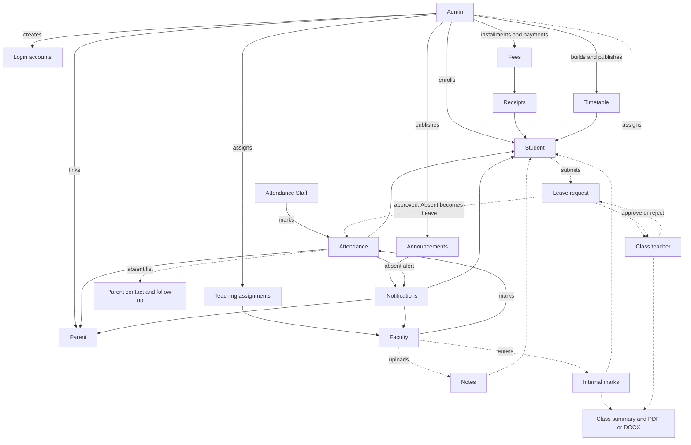
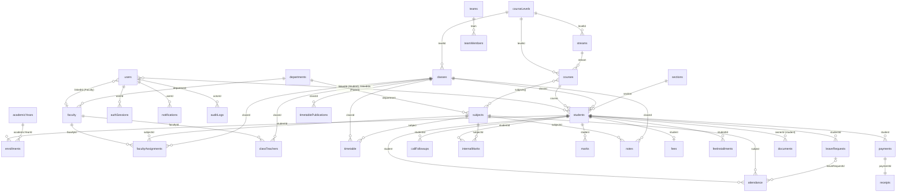

# Sri Sai PU and Degree College — College Management System

The official website and role-based management portal for **Sri Sai PU and Degree College**.

| | |
|---|---|
| **Version** | Development |
| **Release status** | Not yet released or deployed |
| **Last updated** | 2026-09-14 |
| **License** | Not currently specified |

> This README documents the code **as it currently exists**. Features that are designed but not
> built are marked **Not currently implemented**. Backend features that work but have no screen yet
> are marked **API only**. See [Known limitations](#47-known-limitations-and-incomplete-features)
> before deploying.

---

## Contents

1. [Project overview](#1-project-overview)
2. [Technologies used](#2-technologies-used)
3. [Languages](#3-languages)
4. [Folder structure](#4-folder-structure)
5. [Important files](#5-important-files)
6. [Frontend](#6-frontend)
7. [Backend](#7-backend)
8. [Database](#8-database)
9. [Authentication](#9-authentication)
10. [Role permissions](#10-role-permissions)
11. [Admin module](#11-admin-module)
12. [Student module](#12-student-module)
13. [Faculty module](#13-faculty-module)
14. [Attendance module](#14-attendance-module)
15. [Parent module](#15-parent-module)
16. [Fees](#16-fees)
17. [Notes](#17-notes)
18. [Internal marks](#18-internal-marks)
19. [Leave management](#19-leave-management)
20. [Notifications](#20-notifications)
21. [File uploads](#21-file-uploads)
22. [College branding assets](#22-college-branding-assets)
23. [Environment variables](#23-environment-variables)
24. [Local development setup](#24-local-development-setup)
25. [Development data](#25-development-data)
26. [Running the application](#26-running-the-application)
27. [Build](#27-build)
28. [Git and GitHub](#28-git-and-github)
29. [.gitignore](#29-gitignore)
30. [GitHub security](#30-github-security)
31. [Deployment architecture](#31-deployment-architecture)
32. [Frontend deployment on Vercel](#32-frontend-deployment-on-vercel)
33. [Backend deployment](#33-backend-deployment)
34. [Database production setup](#34-database-production-setup)
35. [File storage in production](#35-file-storage-in-production)
36. [Custom domain](#36-custom-domain)
37. [Domain email](#37-domain-email)
38. [CORS and production security](#38-cors-and-production-security)
39. [HTTPS](#39-https)
40. [Production security checklist](#40-production-security-checklist)
41. [Testing](#41-testing)
42. [Troubleshooting](#42-troubleshooting)
43. [Deployment checklist](#43-deployment-checklist)
44. [Project workflow diagram](#44-project-workflow-diagram)
45. [Database relationship diagram](#45-database-relationship-diagram)
46. [API documentation](#46-api-documentation)
47. [Known limitations and incomplete features](#47-known-limitations-and-incomplete-features)
48. [Changelog and version](#48-changelog-and-version)
49. [Contributing](#49-contributing)
50. [License](#50-license)
51. [Managing official college data](#51-managing-official-college-data)
52. [Production deployment summary](#production-deployment-summary)

---

## 1. Project overview

### What it is

A full-stack web application with two parts:

1. **Public website** (no login): home page, departments, faculty directory, sports achievements,
   academic achievements, campus gallery, contact details, an admission inquiry form and a
   "Developed By" section.
2. **Management portal** with five roles — **Admin, Faculty, Attendance Staff, Student and Parent** —
   each with its own dashboard and a strictly limited view of the data.

### Why it exists and what it solves

- **One source of truth** for students, faculty, courses, attendance, marks, fees and announcements,
  instead of scattered registers and spreadsheets.
- **Controlled accounts**: only an Admin can create login accounts. Nobody self-registers.
- **Privacy by role**: a student sees only their own records; a parent only their linked children;
  a faculty member only the subjects and classes they are assigned to.
- **Accountability**: important administrative actions are written to an audit log.
- **Communication**: targeted announcements and in-app notifications.

### Architecture in simple terms

The browser loads a React single-page application. Every piece of data comes from an Express API,
which checks who you are and what you may see before reading or writing a JSON database file on the
server. Uploaded files are kept on the server's disk.

```
                         ┌───────────────────────────────────────────┐
  Browser  ─────────────▶│ Frontend — React single-page app          │  frontend/
                         │ (development: Vite dev server, port 5173) │
                         └──────────────────┬────────────────────────┘
                                            │  /api/*  and  /uploads/*
                                            ▼  (proxied by Vite in development)
                         ┌───────────────────────────────────────────┐
                         │ Backend — Node.js + Express, port 5000    │  backend/server.js
                         │  1. verifyToken: JWT + server session     │  backend/middleware/auth.js
                         │  2. role checks (requireRole)             │
                         │  3. ownership / assignment checks         │  backend/scope.js
                         └──────────┬─────────────────────┬──────────┘
                                    ▼                     ▼
                  ┌──────────────────────────┐  ┌──────────────────────────────────────┐
                  │ Database                 │  │ File storage (server disk)           │
                  │ backend/db.js            │  │ backend/uploads/          public     │
                  │  in-memory cache  ⇄      │  │ backend/private-uploads/  authorised │
                  │ backend/data.json        │  │                           download   │
                  └──────────────────────────┘  └──────────────────────────────────────┘
```

---

## 2. Technologies used

Versions are the **installed** versions found in `node_modules` unless marked *declared*.

### Used by the running application

| Technology | Part | Purpose | Version |
|---|---|---|---|
| Node.js | Backend runtime, build tooling | Runs the API and the Vite toolchain | `>=22.12.0` required (developed on v24.15.0) |
| npm | Both | Package manager | developed with 11.12.1 |
| React | Frontend | UI library | 19.2.8 |
| React DOM | Frontend | Renders React in the browser | 19.2.8 |
| React Router DOM | Frontend | Client-side routing | 7.18.3 |
| Vite | Frontend | Dev server, proxy and production build | 8.3.0 |
| @vitejs/plugin-react | Frontend | React support for Vite | 6.1.1 |
| Tailwind CSS | Frontend | Styling (CSS-first `@theme` configuration) | 4.3.3 |
| @tailwindcss/vite | Frontend | Tailwind integration for Vite | 4.3.3 |
| Framer Motion | Frontend | Page transitions and animations | 13.2.0 |
| Axios | Frontend | HTTP client for the API | 1.20.0 |
| lucide-react | Frontend | Icons | 1.44.0 |
| oxlint | Frontend | Linter (`npm run lint`) | ^1.81.0 *declared* |
| Google Fonts | Frontend | Source Serif 4 and Public Sans, loaded in `index.html` | — |
| Express | Backend | HTTP API framework | 4.22.3 |
| jsonwebtoken | Backend | Signs and verifies login tokens | 9.0.3 |
| bcryptjs | Backend | Password hashing | 2.4.3 |
| cors | Backend | Cross-origin headers | 2.8.6 |
| multer | Backend | Multipart file uploads | 2.3.0 |
| pdfkit | Backend | A4 class result PDF generation | 0.20.2 |
| docx | Backend | Class result Word (.docx) generation | 9.7.1 |
| Node.js built-ins | Backend | `fs` (database file, uploads), `path`, `crypto` (session ids) | — |

### Installed but not used by the running application

These are listed in `frontend/package.json` but nothing that renders imports them. They can be removed
in a future clean-up.

| Package | Version | Finding |
|---|---|---|
| three | 0.186.0 | Imported only by `src/components/three/*`, which no page imports |
| @react-three/fiber | 9.7.0 | Same as above |
| @react-three/drei | 10.7.8 | Same as above |
| recharts | 3.10.1 | Never imported — charts are custom SVG in `src/components/Charts.jsx` |
| gsap | 3.15.0 | Never imported |
| react-is | ^19.3.0 *declared* | Never imported |
| postcss, autoprefixer | ^8.5.28, ^10.5.5 *declared* | No PostCSS configuration file exists |
| @types/react, @types/react-dom | *declared* | Editor type hints only; there is no TypeScript source |

The root `package.json` declares only `framer-motion` and is not used by either application (each has its
own `package.json`).

### By category

| Category | What this project uses |
|---|---|
| Frontend language | JavaScript with JSX |
| Backend language | JavaScript on Node.js (CommonJS; the dev-seed script is an ES module) |
| Database technology | **JSON file** (`backend/data.json`) — no database server |
| ORM / query library | None — `backend/db.js` and `backend/repo.js` are hand-written |
| Authentication | JWT (jsonwebtoken) + server-side sessions + bcrypt hashing (bcryptjs) |
| UI framework | React |
| CSS framework | Tailwind CSS v4 |
| Animation | Framer Motion, plus CSS transitions in `src/index.css` |
| File uploads | multer |
| PDF generation | pdfkit |
| DOCX generation | docx |
| Charts | Custom SVG components — no chart library in use |
| Validation | None — hand-written checks in each route |
| Testing | **None installed** |
| Build tool | Vite |
| Linting / formatting | oxlint for linting; no formatter configured |

---

## 3. Languages

| Language | Where it is used |
|---|---|
| JavaScript (ES modules, JSX) | `frontend/src/**`, `frontend/vite.config.js` |
| JavaScript (Node.js, CommonJS) | `backend/*.js`, `backend/routes`, `backend/middleware`, `backend/exporters` |
| JavaScript (Node.js ES module) | `backend/scripts/dev-seed.mjs` |
| CSS | `frontend/src/index.css` — Tailwind v4 theme tokens, light and dark colours, shared utilities |
| HTML | `frontend/index.html` |
| JSON | `package.json` files, `frontend/.oxlintrc.json`, `backend/data.json` (runtime database, not committed) |
| SQL | `database/schema.sql` — a reference file only; the application never executes it |
| Markdown | `README.md`, `frontend/README.md` |

**Not used:** TypeScript (only `@types` packages for editor hints) and shell scripts (none in the repository).

---

## 4. Folder structure

```
college-management-system/
├── README.md
├── .gitignore
├── vercel.json                   Vercel Services config: /api and /uploads → backend, all else → frontend
├── package.json                  stray root manifest (framer-motion only) — not used by either app
├── database/
│   └── schema.sql                legacy MySQL reference schema — OUT OF DATE, not used by the app
├── backend/                      Node.js + Express API
│   ├── server.js                 entry point: middleware and route mounting
│   ├── storage.js                data directory (DATA_DIR): data.json, uploads, private-uploads
│   ├── db.js                     JSON-file persistence: seed data, migrations, load/save
│   ├── repo.js                   table-shaped helpers over the JSON store (e.g. pagination)
│   ├── scope.js                  who may see what: assignments, class teachers, parents
│   ├── services.js               audit log, notifications, announcement audience rules
│   ├── utils.js                  username/password generation, grade calculation
│   ├── middleware/
│   │   └── auth.js               token + server-session verification, role guard
│   ├── routes/                   one file per API area
│   ├── exporters/
│   │   └── classResult.js        A4 class result as PDF and DOCX
│   ├── scripts/
│   │   └── dev-seed.mjs          development/demo data, created through the API
│   ├── .env.example              environment variable template
│   ├── data.json                 runtime database — created on first run, git-ignored
│   ├── uploads/                  public uploaded files — git-ignored
│   └── private-uploads/          private documents, notes, leave files — git-ignored
└── frontend/                     React + Vite single-page app
    ├── index.html                HTML shell, Google Fonts, theme bootstrap script
    ├── vite.config.js            dev proxy for /api and /uploads, build chunking
    ├── .oxlintrc.json            linter rules
    ├── README.md                 pointer to this file
    ├── public/
    │   ├── campus/               real college logo and photographs
    │   ├── favicon.svg
    │   └── icons.svg
    └── src/
        ├── main.jsx              React entry point
        ├── App.jsx               every route in the application
        ├── index.css             Tailwind theme, light/dark tokens, shared utilities
        ├── api/                  client.js (Axios instance), session.js (sign-in storage)
        ├── context/              AuthContext, DataContext, ThemeContext, ToastContext
        ├── hooks/                useMySubjects, useIsMobile, usePrefersReducedMotion, useCatSounds
        ├── components/           shared UI: Layout, Sidebar, Topbar, Modal, Table, Charts, CatMascot …
        │   ├── home/             public homepage sections
        │   └── three/            3D components — not imported anywhere
        ├── pages/                one file per screen
        └── assets/               image assets from the Vite template
```

---

## 5. Important files

| File | Purpose |
|---|---|
| `backend/package.json` | Backend dependencies; `dev` and `start` scripts; Node version requirement |
| `backend/server.js` | Creates the Express app, applies middleware, mounts every router, starts listening on `PORT` |
| `vercel.json` | Vercel Services deployment: service definitions and the public routing table |
| `backend/storage.js` | Resolves `DATA_DIR` and the database / upload locations |
| `backend/db.js` | The database: default seed data, record migrations, `load()` and `save()` over `data.json` |
| `backend/repo.js` | `findAll`, `findById`, `insert`, `update`, `remove`, `paginate` helpers |
| `backend/scope.js` | Central access rules: teaching assignments, class teachers, parent links, section matching |
| `backend/services.js` | `audit()`, `notify()`, announcement audience matching and recipient lists |
| `backend/middleware/auth.js` | `verifyToken`, `requireRole`, session creation and revocation |
| `backend/routes/auth.js` | Login, logout, current user, change password |
| `backend/routes/genericCrud.js` | Factory producing list/create/update/delete routes for simple collections |
| `backend/exporters/classResult.js` | Renders class results to PDF (pdfkit) and DOCX (docx) |
| `backend/scripts/dev-seed.mjs` | Creates demo accounts and records through the API |
| `backend/.env.example` | Template listing environment variable names (no values) |
| `backend/data.json` | Runtime database. **Never commit.** |
| `database/schema.sql` | Legacy MySQL schema with 15 tables. **Out of date** — the live model has 42 collections |
| `frontend/package.json` | Frontend dependencies and scripts |
| `frontend/vite.config.js` | Proxies `/api` and `/uploads` to `http://localhost:5000` during development |
| `frontend/index.html` | Page shell; applies the saved theme before first paint to avoid a flash |
| `frontend/src/main.jsx` | Mounts `<App />` |
| `frontend/src/App.jsx` | Route table: public pages and role-protected areas |
| `frontend/src/api/client.js` | Axios instance with base URL `/api`; attaches the token; handles 401 |
| `frontend/src/api/session.js` | The only code that reads or writes sign-in data in browser storage |
| `frontend/src/context/AuthContext.jsx` | Current user, `login`, `logout`, session reset |
| `frontend/src/components/ProtectedRoute.jsx` | Sends signed-out users to `/login` and wrong-role users to their own home |
| `frontend/src/components/Sidebar.jsx` | Menu for each role |
| `frontend/src/pages/Login.jsx` | Login page, role selector, Student cat mascot |
| `frontend/src/index.css` | Theme colours, dark mode tokens, shared styles |
| `.gitignore` | Keeps secrets, the database and uploads out of Git |

No `.env` file exists in the repository, and none should be committed.

---

## 6. Frontend

### How it starts

`npm run dev` starts Vite on `http://localhost:5173`. Vite serves `index.html`, which:

1. Loads Google Fonts.
2. Runs a small inline script that reads the saved theme (`cms_theme` in localStorage, falling back to
   the operating system's colour preference) and sets `data-theme` on `<html>` **before** React loads,
   so there is no light/dark flash.
3. Loads `src/main.jsx`, which renders `<App />` inside React `StrictMode`.

### Routing

`src/App.jsx` uses React Router's `BrowserRouter`. Pages are lazy-loaded with `React.lazy`, so each
screen's code downloads only when it is visited. Route changes animate with Framer Motion's
`AnimatePresence`.

- **Public routes:** `/`, `/faculty-directory`, `/faculty-directory/:id`, `/departments`,
  `/departments/:id`, `/sports`, `/achievements`, `/gallery`, `/teams`, `/teams/:id`, `/login`.
- **Role areas:** `/admin/*`, `/faculty/*`, `/attendance-staff/*`, `/student/*`, `/parent/*`.

Every role route is wrapped as `ProtectedRoute(role) → Layout (Sidebar + Topbar) → page`.
`ProtectedRoute` shows a loader while the session is checked, redirects to `/login` when nobody is
signed in, and redirects a signed-in user who opens another role's area to their own home.

> Hiding a link is never the security control. Every protected API enforces its own checks on the
> server; the route guard only decides which screen to show.

### Authentication state

- `src/api/session.js` owns all sign-in storage: the token (`cms_token`) and the non-sensitive profile
  (`cms_user`). **The password is never stored.**
- `src/context/AuthContext.jsx` exposes `user`, `login(username, password, { role, remember })`,
  `logout()` and `sessionId`. On load it asks the server `GET /api/auth/me` and trusts the server's
  answer over the stored copy.
- `src/context/DataContext.jsx` caches departments, courses and subjects (plus faculty for Admin and
  Faculty) and **empties that cache whenever the account changes**.

### API calls

`src/api/client.js` creates an Axios instance with `baseURL: "/api"` — a **relative** URL:

- In development, Vite's proxy forwards `/api` and `/uploads` to the backend on port 5000.
- In production, the frontend's host must forward the same paths to the backend
  (see [Vercel deployment](#32-frontend-deployment-on-vercel)).

The client adds `Authorization: Bearer <token>` to every request. A `401` response — an expired or
revoked session — clears sign-in storage and returns the user to `/login`.

### Role dashboards

After login, `ROLE_HOME` in `Login.jsx` sends each role to its home: `/admin`, `/faculty`,
`/attendance-staff`, `/student` or `/parent`. The sidebar menu comes from `MENUS` in
`src/components/Sidebar.jsx`.

### Themes

`src/context/ThemeContext.jsx` toggles `data-theme="light"` / `"dark"` on `<html>` and saves the choice
as `cms_theme`. Colours are CSS variables defined in `src/index.css` and redefined for dark mode.

### Responsive design

Layouts use Tailwind breakpoint classes. `useIsMobile` switches behaviour on small screens (for example,
the sidebar becomes a slide-in drawer). Wide tables sit in horizontally scrolling containers.

### Motion and accessibility

`usePrefersReducedMotion` disables non-essential animation for users who ask their operating system to
reduce motion. Dialogs lock background scroll, close on Escape and move focus into the dialog.

### The Student login cat

`src/components/CatMascot.jsx` is an inline SVG animation — no 3D engine, no WebGL. It appears only when
the **Student** role is selected on the login page.

- **States:** `idle`, `watching`, `username`, `password`, `peek`, `thinking`, `checking`, `success`,
  `error`.
- It follows the pointer, covers its eyes while the password is typed, peeks with one eye after a short
  pause (900 ms), and reacts to success or failure.
- `src/hooks/useCatSounds.js` plays optional short tones with the Web Audio API (`type`, `thinking`,
  `success`, `error`). Sound is off by default and the preference is kept in localStorage.

### How components are organised

| Folder | Contents |
|---|---|
| `components/` | Shared building blocks: `Layout`, `Sidebar`, `Topbar`, `Modal`, `ConfirmDialog`, `Table`, `Tabs`, `Button`, `StatCard`, `StatusBadge`, `EmptyState`, `ErrorState`, `Loader`, `Charts`, `NotificationBell`, `GlobalSearch`, `GenericCrudPage`, `CatMascot`, `CollegeLogo`, `CampusImage` |
| `components/home/` | Public homepage sections: `Hero`, `CollegeIntro`, `Programs`, `CampusShowcase`, `DepartmentsStrip`, `FacultyHighlight`, `SportsExcellence`, `AchievementsTeaser`, `Announcements`, `GalleryPreview`, `AdmissionsCTA`, `VisionMission`, `Contact`, `DevelopedBy`, `PublicNav`, `PublicFooter` |
| `components/three/` | Unused 3D components (not imported) |
| `pages/` | One component per screen |
| `hooks/` | `useMySubjects` (subjects the signed-in faculty member is assigned), `useIsMobile`, `usePrefersReducedMotion`, `useCatSounds` |

---

## 7. Backend

### How it starts

`npm run dev` (or `npm start`) runs `node --env-file-if-exists=.env server.js`:

1. Node loads `backend/.env` if it exists.
2. `server.js` requires every router. While loading, `routes/auth.js` calls `load()` from `db.js`. On the
   **first** run this creates `backend/data.json` from the seed data, applies the migrations, and gives
   the seed accounts real bcrypt password hashes.
3. The server listens on `PORT` (default `5000`) and logs its health-check URL.

There is no automatic reload: **restart the backend after changing backend code.** Also restart after
editing `data.json` by hand — `db.js` keeps the database in memory and does not re-read the file.

### Middleware order (`server.js`)

1. `trust proxy` and CORS — no cross-origin access unless `CORS_ORIGINS` lists origins (see [CORS](#38-cors-and-production-security)).
2. `express.json()` — parses JSON bodies (Express's default size limit).
3. `GET /uploads/:file` — serves public uploads from `DATA_DIR/uploads/`.
4. `GET /api/health` — health check.
5. `Cache-Control: no-store` on every `/api` response except `/api/public/*`, so authenticated data is
   never replayed from a cache.
6. All routers.
7. A JSON `404` handler and a JSON `500` error handler that never reveal internal details.

### API structure

There are no separate controller or service layers per resource: each file in `routes/` contains its
handlers. Shared logic lives in `scope.js` (access rules), `services.js` (audit and notifications) and
`repo.js` (data helpers). Simple collections — departments, courses, subjects, streams, classes,
sections, academic years, exams, notices, gallery, teams, sports achievements, academic merit and
admission inquiries — are served by the `genericCrud` factory.

### Request flow

```
Frontend (Axios, Bearer token)
   │
   ▼
Express router
   │
   ▼
verifyToken ── is the JWT signature valid?
   │        ── does its session (jti) exist, belong to this user and remain unrevoked?
   │        ── does the account still exist and is it Active?
   ▼
requireRole ── is the role allowed for this route?
   │
   ▼
Ownership / assignment checks (scope.js)
   │        ── Student: only their own id
   │        ── Parent: only linked children
   │        ── Faculty: only assigned subjects, classes and sections
   ▼
Validation (hand-written in the route)
   │
   ▼
db.js / repo.js ── read or change the in-memory data, then write data.json
   │
   ▼
audit() / notify() where relevant
   │
   ▼
JSON response
```

### Authorization

- `requireRole(...roles)` rejects other roles with `403`.
- `scope.js` answers the finer questions: `canViewStudent`, `canTouchSubjectInClass`,
  `isClassTeacherFor`, `visibleStudentIds` and more. A section-restricted assignment covers only its own
  section — never a request for the whole class.
- Where revealing that a record exists would itself leak information (another user's notification,
  document, leave request or note), the API answers `404`, not `403`.

### Validation and error handling

Validation is written by hand in each route: required fields, date formats, number ranges (marks cannot
exceed the maximum; payments cannot exceed the balance), and that referenced ids exist. Errors return
JSON such as `{ "error": "..." }` with an appropriate status code.

### File uploads

multer handles uploads in `routes/uploads.js`, `routes/notes.js` and `routes/leaveRequests.js`.
See [File uploads](#21-file-uploads) for formats, sizes and access.

### Notifications and audit

`services.notify()` writes per-user notification rows. `services.audit()` records who did what, when, on
which record, with before/after values where useful, and the request's IP address and user agent.
Password fields are redacted before anything is written to the audit log.

### Security measures in the code

- Passwords hashed with bcrypt; never stored or returned in plain text.
- Server-side sessions: logout, password reset and deactivation end sessions immediately.
- Login uses a generic error message and constant-time comparison for unknown usernames, so neither the
  message nor response timing reveals which usernames exist.
- The role chosen on the login screen must match the account.
- API responses project away sensitive fields: password hashes are never returned; faculty salary is
  hidden from everyone except Admin and the faculty member themselves.
- Private files are never served statically; they are streamed only after an authorisation check.
- Upload type and size limits are enforced.
- CORS closed by default; `JWT_SECRET` required in production.
- **Not currently implemented:** rate limiting, security headers (e.g. helmet).

---

## 8. Database

### Technology

The database is a **JSON file**, `backend/data.json`, managed by `backend/db.js`. There is no database
server, connection string or ORM.

- `load()` reads the file once and keeps the whole database **in memory**.
- `save()` writes the entire database back to the file synchronously.
- If the file does not exist, `load()` creates it from `seed()` and applies the migrations.

### Consequences to understand

- **Single process only.** Two backend instances would each hold their own copy in memory and overwrite
  each other's writes. Run exactly one instance.
- **No indexes, foreign keys or transactions.** Relationships are plain id fields; route code enforces
  them.
- **Every write rewrites the whole file.** Fine at college scale; not suited to heavy concurrent writes.
- **Restart after editing the file by hand**, because the in-memory copy is not reloaded.

### Migrations and seeding

- `seed()` in `db.js` defines the default dataset for a new install.
- On every start, `load()` adds any collection that is missing from an older file.
- `migrate()` backfills new fields on existing records (for example account `status`, `createdAt` and
  `lastLogin`). It never overwrites a value that is already set.
- Named one-time migrations are recorded in `_migrations`, so they never run twice. Each one inserts rows
  only once — a row an Admin deletes does not come back.
  - `optional-puc-combinations` — adds CEBA, SEBA, MEBA and MSBA **switched off**.
  - `bca-structure-2026` — adds the BCA subjects, the AI and General sections, BCA teaching assignments
    and class teachers, scoped to the current academic year.

### `database/schema.sql`

A legacy MySQL schema with 15 tables (`departments`, `courses`, `faculty`, `subjects`, `students`,
`users`, `attendance`, `exams`, `marks`, `fees`, `payments`, `timetable`, `assignments`, `submissions`,
`notices`). It **does not describe the current data model** and the application never uses it.
Moving to a relational database is **Not currently implemented** and would need an up-to-date schema
plus changes across the routes, which read and write `db.js` data directly.

### Collections

Every name below is a real top-level key in `data.json`.

| Collection | Contents | Key relationships |
|---|---|---|
| `users` | Login accounts: username, bcrypt password hash, role, status, `mustReset`, `createdAt`, `lastLogin` | `linkedId` → `students` (Student) or `faculty` (Faculty); `linkedIds[]` → `students` (Parent) |
| `authSessions` | One server-side session per issued token: `jti`, `expiresAt`, `revokedAt` | `userId` → `users` |
| `students` | Student profiles and academic placement | `course` → `courses`; `classId` → `classes`; `section` → `sections`; `department` → `departments` |
| `enrollments` | One enrollment per student per academic year | `studentId`, `academicYearId`, `courseId`, `classId`, `sectionId` |
| `faculty` | Faculty profiles (includes an unused `salary` field) | `department` → `departments` |
| `departments` | Subject departments | — |
| `courseLevels` | `PUC` and `Degree` | — |
| `streams` | Science and Commerce (PUC) | `levelId` → `courseLevels` |
| `courses` | PUC combinations and degree programmes, with an `active` flag | `levelId`, `stream`, `subjects[]` → `subjects` |
| `subjects` | Subjects (BCA subjects also carry the class they are taught in) | `department`, `courseId`, `classId` |
| `classes` | I PUC, II PUC, 1st/2nd/3rd Year | `levelId` → `courseLevels` |
| `sections` | Sections (currently AI and General) | — |
| `academicYears` | Academic years; one is marked current | — |
| `facultyAssignments` | Who teaches which subject to which class/section in which year | `facultyId`, `subjectId`, `classId`, `sectionId`, `academicYearId` |
| `classTeachers` | Class teacher per class/section per year | `facultyId`, `classId`, `sectionId`, `courseId`, `academicYearId` |
| `timetable` | Timetable periods | `classId`, `sectionId`, `subject`, `faculty`, `academicYearId` |
| `timetablePublications` | Which class timetables are published (plus optional PDF) | `classId`, `documentId` → `documents` |
| `attendance` | One mark per student per register; `Present`, `Absent` or `Leave`; who took it and when | `student`, `subject`, `classId`, `sectionId`, `facultyId`, `leaveRequestId` |
| `leaveRequests` | Student leave requests and decisions | `studentId`, `classTeacherId` → `faculty` |
| `callFollowups` | Parent follow-up records, append-only | `studentId`, `callerUserId` → `users` |
| `internalMarks` | Internal assessment marks with change history | `studentId`, `subjectId`, `classId`, `sectionId` |
| `marks` | Older fixed-component marks module | `student`, `subject` |
| `exams` | Exam schedule entries | `subject` |
| `notes` | Study notes | `subjectId`, `classId`, `sectionId`, `courseId`, `academicYearId` |
| `fees` | One fee record per student: total, paid, status | `student` → `students` |
| `feeInstallments` | Scheduled installments | `studentId` |
| `payments` | Recorded payments | `student` |
| `receipts` | Generated receipts | `studentId`, `paymentId` → `payments` |
| `assignments` | Assignments with submitted student ids | `createdBy` → `faculty` |
| `announcements` | Targeted announcements | `audience` (roles, streams, departments, classes, students) |
| `notices` | Older notice board | — |
| `notifications` | Per-user in-app notifications | `userId` → `users` |
| `documents` | Private documents | `ownerType` + `ownerId` |
| `auditLogs` | Administrative action history | `actorId` → `users` |
| `admissionInquiries` | Inquiries from the public website | — |
| `sportsAchievements`, `academicMerit`, `galleryItems`, `teams`, `teamMembers` | Public website content | `teamMembers.team` → `teams` |
| `collegeProfile` | Single object: college name, address, contact, vision, mission | — |
| `seq` | Id counters | — |
| `_migrations` | Names of applied one-time migrations | — |

### What does not exist as a separate collection

- **Parents** and **Attendance Staff** are rows in `users` with those roles. A parent's children are in
  `users.linkedIds`.
- **Results** are computed on request from `marks` (older module) or `internalMarks`.
- **Salary** has no collection. The `faculty.salary` field exists, but no API or screen can set it.
  **Not currently implemented.**

---

## 9. Authentication

### Accounts are created only by an Admin

There is **no registration endpoint**. Students, faculty, parents and attendance staff cannot create
accounts.

- **Student:** Admin enrolls the student (`Enroll Student`), then creates the login — in the same step
  or later from **Login Accounts**.
- **Faculty:** Admin adds the faculty record; a linked login is created with it.
- **Parent** and **Attendance Staff:** Admin creates the account in **Login Accounts**. A parent is
  linked to one or more students.

A username and a random temporary password are generated. The password is shown **once**, is stored only
as a bcrypt hash, and must be changed at first sign-in (`mustReset`).

### Login

1. The user picks a role and enters a username and password.
2. The browser sends exactly those values plus the selected role:
   `POST /api/auth/login { username, password, role }`.
3. The server checks the password with bcrypt. An unknown username is compared against a dummy hash, so
   timing does not reveal whether the account exists.
4. The selected role must match the account's role. A mismatch returns the **same generic error** as a
   wrong password.
5. A deactivated account is refused.
6. The server creates a session row in `authSessions` and returns a JWT containing its session id
   (`jti`), valid for **8 hours**.
7. The frontend stores the token:
   - **Remember me unchecked (default):** `sessionStorage` — gone when the tab or browser closes.
   - **Remember me checked:** `localStorage` — survives closing the browser.

### Every protected request

`verifyToken` checks the JWT signature, then that its session exists, belongs to that user and is not
revoked, then that the account exists and is active. Role and ownership checks follow.

### Logout and session invalidation

1. The frontend captures the current token and calls `POST /api/auth/logout` with it.
2. The server marks that session **revoked**. The token stops working on its very next use — a copy of it
   cannot keep accessing the API.
3. The frontend removes the token and profile from **both** localStorage and sessionStorage. The theme
   and login-sound preferences are deliberately kept.
4. The in-memory user and every cached record are cleared.
5. The browser is sent to `/login` with the history entry replaced.

Sessions are also revoked when an Admin resets a password or deactivates an account. Changing your own
password ends all your *other* sessions.

### Role switching on the login page

Selecting a different role clears the username, password, error, loading state and cat state, and
rebuilds the form from scratch — which also discards anything the browser's autofill had filled in.
Because the server enforces the selected role, leftover credentials from another role cannot sign in.

### The fixed logout/session bug

**Before:** after `Admin login → Logout`, the login page could still show the Admin's credentials, and
signing in with **Student** selected could land back in the Admin dashboard.

**Causes found and fixed:**

| Cause | Fix |
|---|---|
| The selected role was ignored by the server | Login now requires the role to match the account |
| Switching role kept the typed username and password | Role switch resets the form and rebuilds the inputs |
| Logout happened only in the browser; the token stayed valid for 8 hours | Server-side sessions; logout revokes the session |
| Sign-in keys were cleared inconsistently (the 401 handler missed sessionStorage) | `src/api/session.js` owns all sign-in storage and clears both storages |
| "Remember me" was a dead checkbox, checked by default | It now chooses sessionStorage or localStorage and defaults to off |
| Visiting `/login` while signed in bounced back to the old dashboard | Arriving at `/login` ends any existing session |

**Now:** `Admin login → Logout → Student login` always creates a completely fresh, Student-only session.

### Password storage

Passwords are hashed with bcrypt (cost 10). They are never stored in plain text on the server, and
never stored in browser storage, cookies or IndexedDB. The application sets no cookies.

---

## 10. Role permissions

**Legend:** **Full** = create, read, update, delete · **Scoped** = only assigned classes/subjects ·
**Own** = only the signed-in user's records · **Linked** = only the parent's linked children ·
**(API)** = enforced and working on the server, no screen yet · **—** = no access

| Feature | Admin | Faculty | Attendance Staff | Student | Parent |
|---|---|---|---|---|---|
| Login accounts: create, activate/deactivate, reset password | Full (deactivate, no delete) | — | — | — | — |
| Student records and enrollment | Full | Read all ⚠️ | Read all | Own | Linked |
| Faculty records | Full | Read; colleagues' salary hidden | Directory fields | Directory fields | Directory fields |
| Academic setup: departments, courses, combinations, subjects, streams, classes, sections, academic years | Full | Read | Read | Read | Read |
| Teaching assignments | Full | Own (read) | — | — | — |
| Class teacher assignments | Full (API) | Own (read, API) | — | — | — |
| Timetable | Full + publish/withdraw | Published, own classes and periods | Read all | Published, own class | Published, child's class (API) |
| Mark attendance | All subjects | Scoped | All subjects | — | — |
| View attendance | All | Scoped | All | Own | Linked |
| Attendance reports and CSV export | Yes | Scoped | Yes | — | — |
| Present / absent / leave session lists | Yes (API) | Scoped (API) | Yes (API) | — | — |
| Parent contact and call follow-ups | Yes (API) | Scoped (API) | Yes (API) | — | — |
| Fees and installments | Full (creating the fee record: API only) | — | — | Own (read) | Linked (read) |
| Fee receipts | Issued on payment | — | — | Own (view, print) | Linked (API) |
| Announcements | Full + publish | Targeted (read) | Targeted (read) | Targeted (read) | Targeted (read) |
| Notices (older module) | Full | Full | Read | Read | Read |
| Notifications | Own | Own | Own | Own | Own |
| Notes | Full (API) | Upload and delete own; view scoped (API) | — | Own class (API) | Child's class (API) |
| Internal marks | All (API) | Scoped (API) | — | Own (API) | Linked (API) |
| Class result summary and PDF/DOCX | Yes (API) | Class teacher of that class only (API) | — | — | — |
| Marks and results (older module) | Yes | Enter for assigned subjects | — | Own | Linked |
| Leave requests | All; decide (API) | Class teacher: view and decide (API) | — | Submit, withdraw pending (API) | Linked (API) |
| Assignments | Full | Create; edit and delete own | Read (API) | Read, submit | Read (children's status only) |
| Documents | Upload at enrollment, download, delete | Academic documents of any student ⚠️ | — | Own | Linked |
| Faculty salary | Not currently implemented | — | — | — | — |
| Dashboard analytics and reports | Yes | — | — | — | — |
| Audit log | Yes | — | — | — | — |
| Global search | Yes | — | — | — | — |
| Website content: college profile, gallery, sports, merit, teams | Full | — | — | — | — |
| Admission inquiries | Read, delete | — | — | — | — |

⚠️ **Known gap:** `/api/students` and `/api/documents` predate the assignment-based scoping. A faculty
member can currently read **every** student's record and non-identity documents. Attendance, marks,
internal marks, notes and leave **are** scoped. See [Known limitations](#47-known-limitations-and-incomplete-features).

---

## 11. Admin module

The Admin sidebar is grouped as follows:

| Group | Screens |
|---|---|
| People | Students, Enroll Student, Faculty, Teaching Assignments, Login Accounts |
| Academics | Academic Setup, Departments, Courses & Subjects, Timetable, Examinations, Assignments, Fees |
| Communication | Announcements, Notices, Admissions Inquiries |
| Website | Sports Achievements, Academic Merit List, Gallery, Teams, Team Members, College Profile |
| System | Reports, Audit Log |

### CRUD by module

| Module | Create | Read | Update | Delete |
|---|---|---|---|---|
| Students | Enroll Student wizard | Students list, search | Edit | Delete — also removes the student's login, attendance, marks, fees, enrollments and documents; unlinks parents |
| Login accounts | Create account | List, search, filter | Name, email, parent links | **No delete** — deactivate instead |
| Faculty | Add | List | Edit | Delete |
| Teaching assignments | Assign subject | Grouped by faculty | — | Remove |
| Class teachers | API only | API only | API only | API only |
| Academic setup | Academic years, sections | Combinations, years, classes, sections | Enable/disable combinations; map subjects; set current year | Via generic routes (API) |
| Departments, courses, subjects, exams, notices | Yes | Yes | Yes | Yes |
| Timetable | Add period (clash-checked) | Weekly grid per class | API | Remove period; withdraw publication |
| Fees | Fee record: **API only**; installments; payments | List, totals | — | Unpaid installments only |
| Announcements | Draft or publish, with audience and attachment | List | Edit | Delete (also removes related notifications) |
| Website content | Yes | Yes | Yes | Yes |
| Notes, internal marks, leave requests | API only | API only | API only | API only |
| Faculty salary | Not currently implemented | — | — | — |

Destructive actions ask for confirmation. Where deletion would break history, the system prefers
reversible states: accounts are **deactivated**, combinations are **disabled**, timetables are
**withdrawn**, and paid installments **cannot be deleted**.

### Dashboard analytics

`GET /api/admin/stats` counts real records; an empty database shows zeros and empty states.

- **Cards:** total students, faculty, attendance staff, parents, active and inactive accounts, new
  admissions this year, pending and collected fees, attendance today, live announcements, unread alerts.
- **Admissions breakdown:** total, I PUC, II PUC, all PUC, Degree.
- **Charts:** admissions by academic year, students by stream, by combination and by department, fee
  collection, attendance today, faculty by department, accounts by role.

### Audit log

**Audit Log** lists administrative actions, newest first, filterable by action, record type and text.
Entries show who acted, their role, the time, the affected record, the IP address, and a before/after
comparison where recorded. There is no screen to edit or delete entries.

### Other Admin tools

- **Global search** (Ctrl+K / ⌘K): students, faculty, parents and staff by name, id, phone, email,
  department or combination.
- **Enroll Student wizard:** personal details → course → stream → combination (only combinations the
  college has enabled) → class, section, roll number → documents → review, with an option to create the
  login immediately.
- **Academic Setup:** switch combinations on or off and choose each combination's subjects, which are
  stored in the database rather than written into the frontend.

---

## 12. Student module

A student sees only their own data. Every request is scoped on the server using the student id inside
the session token, never an id the browser chooses — so changing a URL, query parameter or request body
cannot expose another student.

| Screen | Route | What it shows |
|---|---|---|
| Dashboard | `/student` | Welcome, attendance percentage, overall result, fee status, latest notices |
| My Profile | `/student/profile` | Personal and academic details, subjects of the combination, own documents (download) |
| Attendance | `/student/attendance` | Overall and per-subject percentage, present of total |
| Marks & Results | `/student/results` | Results from the older marks module |
| Fee Status | `/student/fees` | Total, paid, pending, installment schedule with overdue status, receipts (print), payment history |
| Timetable | `/student/timetable` | Published timetable for the student's class |
| Assignments | `/student/assignments` | Assignments; submit |
| Announcements | `/student/announcements` | Announcements targeted at this student |
| Notices | `/student/notices` | Notice board |
| Notifications | bell icon | Own notifications |

**API only — no student screen yet:** attendance calendar, absent and leave counts per subject (the API
returns them; the screen shows present and total), notes, internal marks, leave requests, and dashboard
cards for pending leave and new notes.

---

## 13. Faculty module

| Screen | Route | What it does |
|---|---|---|
| Dashboard | `/faculty` | ⚠️ Still reads an older per-subject faculty field, so faculty assigned through **Teaching Assignments** currently see no subjects here |
| Attendance | `/faculty/attendance` | Mark attendance for **assigned** subjects |
| Marks Entry | `/faculty/marks` | Older marks module, assigned subjects only |
| Assignments | `/faculty/assignments` | Create, edit and delete own assignments |
| Timetable | `/faculty/timetable` | Published periods the faculty member teaches |
| Attendance Reports | `/faculty/report` | Report for own subjects, CSV export |
| Announcements / Notices | `/faculty/announcements`, `/faculty/notices` | Targeted announcements; notice board |

### Faculty assignment flow

1. Admin opens **Teaching Assignments** and assigns a subject to a faculty member for a class and
   (optionally) a section, in the current academic year.
2. The faculty member is notified.
3. Their subject lists are built from these assignments (`GET /api/faculty-assignments/my-subjects`).
4. The server refuses attendance, marks or notes for anything not assigned — hiding it in the interface
   is not what protects it.

A faculty member with no assignments sees a clear "no subjects assigned" message and can mark nothing.

### Not currently implemented or API only

- **Welcome popup:** Not currently implemented. Every role sees a short "Welcome back" message after
  login.
- **Class/section-aware attendance screen:** API only. The current Attendance screen builds its register
  from the students whose combination includes the subject, not from the class and section.
- **Notes upload, internal marks, class teacher summary and PDF/DOCX download, leave approval:** API only.
- **Salary slip:** Not currently implemented.
- **Profile:** the user menu's **My Profile** lets any user change their own password.

---

## 14. Attendance module

### Who marks attendance

- **Attendance Staff** — all subjects (`/attendance-staff`), plus reports (`/attendance-staff/report`).
- **Faculty** — assigned subjects only (`/faculty/attendance`).
- **Admin** — all subjects, through the API.

### Recording and submission

`POST /api/attendance` with `{ subject, date, records: [{ student, status }], classId?, sectionId?, period? }`:

1. Validates every row before saving anything: valid status, no duplicate student, the student exists,
   and — when a class is given — every student belongs to it and **every student in the class has a
   status**.
2. **Approved leave wins.** A student on approved leave is saved as `Leave` even if marked otherwise.
   Only an Admin can override this, and only by sending `overrideLeave: true`.
3. Resubmitting the same register replaces it rather than duplicating it.
4. Each mark records who took it (`takenBy`, `takenByName`, `takenByRole`, `facultyId`), when
   (`takenAt`), and the class, section, period and department.
5. A student newly marked **Absent** — and their parents — receive a notification.

Statuses are `Present`, `Absent` and `Leave`. "Not marked" means no record exists; nothing is invented.
**Percentage = present ÷ total**, where leave counts toward the total but not as present
(35 present of 40 classes with 1 leave = 87.5%).

### Reviewing attendance — API only

| Endpoint | Purpose |
|---|---|
| `GET /api/attendance/roster` | Students of a class/section for a subject and date, with existing status and approved leave |
| `GET /api/attendance/session` | One submitted register split into **present, absent and leave**, with totals and percentage |
| `GET /api/attendance/sessions` | Attendance Management list, filterable by department, class, section, subject, date and faculty |
| `GET /api/attendance/student/:id/calendar` | A month of real daily records for the calendar |

The session list never contains parent phone numbers — only whether one exists.

### Parent contact and follow-ups — API only

| Step | Behaviour |
|---|---|
| Parent contact | `GET /api/call-followups/contact/:studentId` returns the guardian's name and phone number and a prepared absence message. Available to Admin, Attendance Staff and faculty who teach that student. Each view is audit-logged. |
| Call / SMS / WhatsApp | **Nothing is sent by the system.** The API returns `capabilities: { aiCalling: false, smsGateway: false, whatsappApi: false }`. A future screen can open the device's own dialler or messaging app with the number and message. |
| AI CALL | **No AI calling exists.** It is only a follow-up type (`AI_CALL`) on a manual follow-up record. |
| Start follow-up | `POST /api/call-followups/start` records the student, parent number, caller and a **server** timestamp. |
| 30-second rule | `PATCH /api/call-followups/:id/comment` is refused until 30 seconds after the server timestamp. This is enforced on the server, not only in a user interface. |
| Comment | Records what was discussed, the parent's response, the absence reason and whether follow-up is needed. |
| History | Append-only: a saved comment cannot be overwritten; every call is a separate record. |

---

## 15. Parent module

A parent sees only the children linked to their account (`users.linkedIds`), enforced on every request.

| Screen | Route | What it shows |
|---|---|---|
| Dashboard | `/parent` | Child switcher (when linked to more than one child), child summary, attendance by subject, marks and results, fees pending |
| Announcements | `/parent/announcements` | Targeted announcements |
| Notifications | bell icon | Own notifications: absence, fees, leave decisions, marks, announcements |

**API only — no parent screen yet:** fee receipts, timetable, leave request status, notes and internal marks.

---

## 16. Fees

| Part | Implementation |
|---|---|
| Fee record | One per student: `total`, `paid`, `status` (`Pending`, `Partially Paid`, `Paid`), `dueDate`. Created with `POST /api/fees` — **API only**, no Admin screen to create one yet. |
| Installments | Admin: **Fees → Installments**. Label, amount and due date. Scheduling more than the total is refused. |
| Payments | Admin: **Fees → Record Payment**. A payment settles the oldest unpaid installments it fully covers. Overpaying is refused. |
| Receipts | Generated automatically for each payment (`RCPT-<studentId>-NNN`), recording amount, mode, date and what it paid for. |
| Receipt upload | **Not currently implemented** — receipts are generated records, not uploaded files. |
| Student access | **Fee Status** shows totals, installments with overdue marking, receipts and payments. Receipts print from a clean A4-style window. |
| Parent access | Pending amount on the dashboard; full fee data and receipts through the API only. |
| Notifications | Student and parents are notified when an installment is scheduled and when a payment is received. |
| Overdue reminders | **Not currently implemented** — no scheduled reminder job. Overdue status is shown, not sent. |
| Statistics | Billed, collected and pending totals on the Admin dashboard. |

---

## 17. Notes

**API only — no screens yet.**

- **Upload:** `POST /api/notes/upload` (file), then `POST /api/notes` to register it against its class.
  Faculty only for a subject they are assigned in that class and section; Admin for any.
- **Formats:** PDF, JPG, JPEG, PNG, DOC, DOCX. **Maximum 20 MB.**
- **Linked to:** academic year, course, class, section, subject, semester and department.
- **Who sees a note:** students — and their parents — whose class matches, whose section matches (or the
  note is for the whole class), and whose course matches if the note names one. Also assigned faculty,
  the uploader and Admin.
- **Viewing:** `GET /api/notes/:id/file?inline=1` displays PDFs and images in the browser; Word files and
  plain `GET /api/notes/:id/file` download.
- **Deleting:** the uploader or an Admin.
- Students in the class are notified when a note is uploaded.

---

## 18. Internal marks

**API only — no screens yet.**

| Step | Endpoint | Rule |
|---|---|---|
| Choose class, section, subject and exam | `GET /api/internal-marks/roster` | Faculty assigned to that subject in that class/section, or Admin |
| Enter marks | `POST /api/internal-marks/bulk` | Maximum marks, obtained marks and remarks per student. Every row is validated before anything is saved. |
| Update marks | Same endpoint | Previous values are kept in the record's `history` |
| Student view | `GET /api/internal-marks/student/:id` | Own (or linked child's) marks per subject and exam, with total, maximum and overall percentage |
| Class performance | `GET /api/internal-marks/class-summary` | **Class teacher of that exact class and section**, or Admin |
| Download result | `GET /api/internal-marks/class-summary/export?format=pdf` or `docx` | Same rule as the class summary |

**Calculations:**
- Total, maximum and percentage per student.
- **Rank** uses standard competition ranking — equal percentages share a rank and the next rank is
  skipped: 1, 2, 2, 4.
- **Topper list** contains ranks 1 to 3, including ties.
- **Needs attention** lists students below 40%, the same pass mark the older marks module uses.
- Students with no marks for the exam are listed separately and are never ranked as zero.
- **Grades** are not calculated for internal marks (the older marks module does calculate A+ to F).

**PDF / DOCX export:** A4, portrait for up to four subjects and landscape beyond that. It includes the
college name, academic year, course, class, section and exam; a table of rank, student ID, name, each
subject's marks, total and percentage; notes on ranking; signature lines for Class Teacher, Head of
Department and Principal; and a generation stamp. The PDF also numbers its pages. Only real marks are
used.

---

## 19. Leave management

**API only — no screens yet.**

1. **Student submits:** `POST /api/leave-requests` with from date, to date, optional subject, reason and
   description. An optional supporting document (PDF, PNG, JPG, JPEG, maximum 8 MB) is uploaded first
   with `POST /api/leave-requests/upload`. Overlapping pending requests are refused.
2. **Routing:** the request goes to the **class teacher** of the student's class and section, who is
   notified. If no class teacher is assigned, Admins are notified instead.
3. **Class teacher decides:** `PATCH /api/leave-requests/:id/decision` with `APPROVED` or `REJECTED` and
   an optional comment. Only that class teacher or an Admin can decide; anyone else gets `404`. A request
   can be decided only once.
4. **Student and parents** are notified of the decision.
5. **Effect on attendance:** approval converts `Absent` marks already recorded in that date range (and
   subject, if given) to `Leave`. It never changes a `Present` mark and never creates attendance for
   future days — those days show `Leave` when their register is taken, and faculty cannot overwrite it.
6. A student may withdraw their own request while it is pending.

---

## 20. Notifications

### Architecture

Notifications are **in-app only**. Rows are stored in `notifications` with a title, message, type,
related record, read flag and time. The bell in the top bar asks `GET /api/notifications` every
**60 seconds** and shows an unread count. Read state lives on the server, so it follows the user across
devices.

- **Actions:** view, mark one as read, mark all as read. Deleting one exists in the API.
- **Privacy:** a user can only ever read or change their own notifications.

### What generates a notification

| Event | Recipients |
|---|---|
| Account created, activated, deactivated or password reset | That user |
| Announcement published | Everyone in its audience |
| Timetable published | Students of the class, their parents, faculty teaching it |
| Teaching assignment or class teacher assignment | That faculty member |
| Document added to a student record | Student and parents |
| Fee installment scheduled, payment received | Student and parents |
| Marks entered (older module), internal marks published or updated | Student and parents |
| Student marked absent | Student and parents |
| Note uploaded | Students of the targeted class/section |
| Leave request submitted | Class teacher, or Admins if none is assigned |
| Leave approved or rejected | Student and parents |

### Not currently implemented

- Browser notifications (the Notification API), Web Push and service workers — so no alerts arrive while
  the site is closed, and no browser permission is requested.
- Email, SMS and WhatsApp notifications.

---

## 21. File uploads

| Upload | Endpoint | Who can upload | Formats | Max size | Stored in | Who can download |
|---|---|---|---|---|---|---|
| Gallery images, team member photos, announcement attachments | `POST /api/uploads` | Admin | PNG, JPG, JPEG, WEBP, GIF | 8 MB | `backend/uploads/` | **Anyone with the URL** — served publicly at `/uploads/<file>` |
| Student documents: photo, SSLC/10th marks card, transfer certificate, Aadhaar, ID proof, caste/income certificate, other | `POST /api/uploads/private`, then `POST /api/documents` | Admin (during enrollment) | PDF, PNG, JPG, JPEG, WEBP | 12 MB | `backend/private-uploads/` | `GET /api/documents/:id/file` — Admin, the student, linked parents, faculty (not Aadhaar/ID proof) |
| Official timetable PDF | `POST /api/uploads/private`, then `POST /api/timetable/publish` | Admin | PDF, PNG, JPG, JPEG, WEBP | 12 MB | `backend/private-uploads/` | Any signed-in user |
| Study notes | `POST /api/notes/upload` | Assigned faculty, Admin | PDF, JPG, JPEG, PNG, DOC, DOCX | 20 MB | `backend/private-uploads/notes/` | Students and parents of the targeted class/section, assigned faculty, uploader, Admin |
| Leave supporting documents | `POST /api/leave-requests/upload` | Student | PDF, PNG, JPG, JPEG | 8 MB | `backend/private-uploads/leave/` | The student, linked parents, the class teacher, Admin |

All upload endpoints require a signed-in user with the listed role. Private files are never served
statically; they are streamed only after an authorisation check, and a request for someone else's file
returns `404`.

**Not currently implemented:** student and faculty profile photo upload (profiles display a photo if one
is set, but no screen sets it), fee receipt files, and stored result files — class results are generated
on demand.

> ⚠️ Announcement attachments are public by URL even when the announcement is targeted at a specific
> audience. Do not attach private documents to announcements.

---

## 22. College branding assets

The real college assets live in `frontend/public/campus/` and are served from `/campus/...`:

| File | Used for |
|---|---|
| `logo.png` | The college crest, shown by `src/components/CollegeLogo.jsx` in the site header, footer, login card and dashboard sidebar |
| `building-1.jpg` | The campus photograph on the home page hero and campus section (`CampusImage`, `CampusShowcase`) |
| `toppers-2025.jpg` | Result announcement poster on the Achievements page |
| `toppers-degree-2025.jpg` | Degree result announcement poster on the Achievements page |

Other files: `frontend/public/favicon.svg` (browser tab icon), `frontend/public/icons.svg`, and
`frontend/src/assets/` (images from the Vite template). If a campus image is missing, `CollegeLogo` and
`CampusImage` show a neutral placeholder instead of a broken image.

Gallery photos added by an Admin are uploaded at run time to `backend/uploads/` (see
[File uploads](#21-file-uploads)).

---

## 23. Environment variables

The frontend code reads **no** environment variables (`import.meta.env` is not used). Its API base URL is
the relative path `/api`, so no URL needs configuring per environment.

### Backend

Template: `backend/.env.example` (names only, no values).

- **Locally:** copy it to `backend/.env`. `npm run dev` and `npm start` load that file automatically
  through Node's `--env-file-if-exists` flag.
- **On Vercel:** set the variables in the project's environment-variable settings.
- **On a Node server:** use `backend/.env` or the service manager's environment.

| Variable | Required | Default | Used in | Purpose |
|---|---|---|---|---|
| `JWT_SECRET` | **Required in production** | A development secret in the source code | `backend/middleware/auth.js` | Signs login tokens. When `NODE_ENV=production` and it is missing, the backend **refuses to start**. |
| `NODE_ENV` | Set by most hosts | — | `backend/middleware/auth.js` | `production` makes `JWT_SECRET` mandatory |
| `PORT` | Optional | `5000` | `backend/server.js` | Port to listen on when started with `npm start`. Hosts usually set it. |
| `DATA_DIR` | Optional | the `backend` folder | `backend/storage.js` | Directory holding `data.json`, `uploads/` and `private-uploads/`. Point it at a persistent, backed-up disk in production. |
| `CORS_ORIGINS` | Optional | empty | `backend/server.js` | Comma-separated origins allowed to call the API cross-origin. Leave empty when the frontend and API share a domain. |

Generate a secret with:

```bash
node -e "console.log(require('crypto').randomBytes(48).toString('hex'))"
```

### Development seed script only

These affect only `backend/scripts/dev-seed.mjs`. The script is not started with `--env-file`, so set them
in the shell when you run it.

| Variable | Required | Default | Purpose |
|---|---|---|---|
| `API` | Optional | `http://localhost:5000/api` | Backend the seed script talks to |
| `DEV_SEED_CREDENTIALS_OUT` | Optional | — | File path, **outside the project**, to save the generated temporary passwords |

**Never** put real secret values in the README, in `.env.example`, or in any committed file.

---

## 24. Local development setup

### Prerequisites

| Tool | Requirement |
|---|---|
| Node.js | **22.12 or newer.** Vite 8 requires `^20.19.0 \|\| >=22.12.0`, and the backend's `--env-file-if-exists` flag needs a recent Node. |
| npm | Bundled with Node.js |
| Git | To clone the repository |
| Database server | **Not needed** — the database is a JSON file |
| Editor | Any; VS Code works well |

### Steps

```bash
# 1. Clone
git clone <GITHUB_REPOSITORY_URL>
cd <repository-folder>

# 2. Backend
cd backend
npm install
cp .env.example .env          # Windows PowerShell:  Copy-Item .env.example .env
# edit .env and set JWT_SECRET

npm run dev                    # http://localhost:5000
```

On the first start the backend creates `backend/data.json` from the seed data and applies the
migrations. There is no separate schema or migration command.

In a **second terminal**:

```bash
# 3. Frontend
cd frontend
npm install
npm run dev                    # http://localhost:5173
```

Open **http://localhost:5173**. Vite forwards `/api` and `/uploads` to the backend, so no CORS setup is
needed locally.

Optionally, with the backend running, add demo data:

```bash
cd backend
node scripts/dev-seed.mjs
```

---

## 25. Development data

> ⚠️ **Development only.** Every credential below is public in this repository. Never deploy with these
> accounts active, and never reuse these passwords.

### Seed accounts created on a fresh install (`backend/db.js`)

| Role | Username |
|---|---|
| Admin | `admin` |
| Faculty | `shashi.pv` |
| Attendance Staff | `attendance.staff` |
| Student | `demo.student` |
| Parent | `demo.parent` |

Their initial passwords are defined in `seed()` in `backend/db.js` and are deliberately not repeated here.
Anyone with access to the repository can read them, so change the admin password and deactivate these
accounts before real use.

The seed also contains the college's real public data: departments, the faculty roster, courses and
combinations, sports achievements, academic merit lists and the college profile. It includes one
placeholder student record labelled `[ADD STUDENT NAME]`.

### Demo data script (`backend/scripts/dev-seed.mjs`)

Creates clearly fictional records **through the real API**, so everything passes normal validation:

- Four demo students, **Demo Student 01–04** (`BCA1-AI-STU001`–`004`), in BCA 1st Year, AI section,
  with guardian numbers `0000000001`–`0000000004`, which no real phone uses.
- Three demo parents (`demo.parent01`–`03`); Demo Parent 02 is linked to two children.
- Login accounts for the four BCA faculty named by the college. Their roster records are not changed.
- Fee records with three installments; two students have paid the first installment.
- Attendance registers, internal marks deliberately including a tie, one sample PDF note and one pending
  leave request.

It prints random **temporary** passwords, which must be changed at first sign-in, and writes the created
record ids (never passwords) to `backend/dev-seed-manifest.json`. It signs in with the seed Admin
account's initial password, so it fails if that password has been changed. Running it again reuses existing records instead of
duplicating them.

**Removing demo data:** there is no automated clean-up script. Use the manifest and the Admin screens:
delete demo students and deactivate demo accounts (accounts cannot be deleted).

`backend/data.json` is not committed, so every developer starts from the seed. Never copy a development
database to production.

---

## 26. Running the application

| Part | Command (run inside the folder) | Purpose | URL |
|---|---|---|---|
| Backend | `npm run dev` | Development | http://localhost:5000 |
| Backend | `npm start` | Production (same command as `dev`; no auto-reload in either) | port from `PORT` |
| Frontend | `npm run dev` | Vite development server | http://localhost:5173 |
| Frontend | `npm run build` | Production build into `frontend/dist/` | — |
| Frontend | `npm run preview` | Serve the production build locally | shown in the terminal |
| Frontend | `npm run lint` | Lint with oxlint | — |

The frontend and backend run separately. During development, both must be running.

---

## 27. Build

```bash
cd frontend
npm run build
```

- Output goes to **`frontend/dist/`** — static HTML, CSS and JavaScript ready for any static host.
- `npm run preview` serves `dist/` locally to check the production build.
- `vite.config.js` splits large vendor libraries into separate chunks.

The backend has **no build step**; it runs directly from source with `npm start`.

---

## 28. Git and GitHub

### Everyday workflow

```bash
git status                       # see what changed
git add <files>                  # stage deliberately; review before using "git add ."
git commit -m "Describe the change"
git push
```

### Starting a new repository

```bash
git init
git add .
git commit -m "Initial college management system"
git branch -M main
git remote add origin <GITHUB_REPOSITORY_URL>
git push -u origin main
```

Create the GitHub repository first: GitHub → **New repository** → choose a name → create it **without**
a README (this project has one) → copy its URL and use it as `<GITHUB_REPOSITORY_URL>`. Consider making it
**private**, because the repository describes a real college system.

This local repository already has a `main` branch and an `origin` remote. Check with `git remote -v`.

### Stop tracking files that were committed before `.gitignore` covered them

`.gitignore` cannot untrack files that are already committed. At the time of writing, these are tracked:

```bash
git rm --cached .claude/settings.local.json .claude/scheduled_tasks.lock
git rm -r --cached backend/uploads
git commit -m "Stop tracking local settings and uploaded files"
```

This removes them from **future** commits only. They remain in the repository's history. If a secret or
private document is ever committed, treat it as exposed and replace or revoke it; removing it from
history requires a history-rewriting tool.

---

## 29. .gitignore

The root `.gitignore` (with `backend/.gitignore` and `frontend/.gitignore`) excludes:

| Pattern | Why |
|---|---|
| `node_modules/` | Installed dependencies; recreated by `npm install` |
| `dist/`, `build/` | Build output; recreated by `npm run build` |
| `.env`, `.env.*` (except `.env.example`) | Secrets such as `JWT_SECRET` |
| `*.log`, `npm-debug.log*`, `.DS_Store`, `Thumbs.db` | Logs and operating-system clutter |
| `backend/data.json` | The runtime database: password hashes, student and parent records, fees, audit logs |
| `backend/uploads/` | Uploaded files (runtime data) |
| `backend/private-uploads/` | Private student documents, notes and leave documents |
| `backend/dev-seed-manifest.json` | Ids of demo records |
| `.vercel/` | Vercel CLI project link and local build output |
| `*.pem`, `*.key`, `*.p12`, `*credentials*.json` | Private keys, certificates and credential exports |
| `tmp/`, `temp/`, `*.tmp` | Temporary files |
| `.claude/settings.local.json`, `.claude/scheduled_tasks.lock` | Machine-specific tool settings |

**Kept in Git because deployment needs them:** `vercel.json`, all source code, `package.json` and `package-lock.json`
files, `backend/.env.example`, `frontend/public/` (including the college logo and photographs),
`database/schema.sql`, and `backend/scripts/dev-seed.mjs`.

**Never commit:** passwords, `JWT_SECRET`, database files, API keys, private certificates or keys,
student documents, fee records, receipts, or faculty salary information.

---

## 30. GitHub security

- **Never commit `.env`.** Only `backend/.env.example`, which holds names and no values.
- **Never commit passwords** — including production admin passwords. The development seed passwords in
  `db.js` are public; production must not use them.
- **Never commit `backend/data.json`** or any copy or backup of it. It contains password hashes and
  personal data.
- **Never commit private student documents, fee receipts, notes or leave documents**
  (`backend/private-uploads/`), or any faculty salary files.
- Use **GitHub Secrets** for any future CI/CD that needs `JWT_SECRET` or deployment credentials.
  No CI/CD is configured in this repository today.
- Enable GitHub's secret scanning and, ideally, keep the repository private.
- Review `git status` and `git diff --staged` before every commit.

---

## 31. Deployment architecture

### Deployment platform

The repository had no deployment configuration. The target configuration for this project uses
**Vercel Services**: several services in one Vercel project, sharing one domain and one routing table.
It is defined in **`vercel.json` at the repository root**:

```json
{
  "services": {
    "frontend": {
      "root": "frontend/",
      "framework": "vite",
      "rewrites": [
        { "source": "/(.*)", "destination": "/index.html" }
      ]
    },
    "backend": {
      "root": "backend/",
      "framework": "express",
      "entrypoint": "server.js"
    }
  },
  "rewrites": [
    { "source": "/api(/.*)?", "destination": { "service": "backend" } },
    { "source": "/uploads/(.*)", "destination": { "service": "backend" } },
    { "source": "/(.*)", "destination": { "service": "frontend" } }
  ]
}
```

How this differs from the draft configuration, and why:

| Change | Reason |
|---|---|
| `"type": "service"` removed from destinations | Vercel's documented destination object accepts only `service` and `path` |
| Backend `framework: "express"` and `entrypoint: "server.js"` | The backend is Express, and `server.js` is its entry file. It exports the app for Vercel and still listens on `PORT` when started with `npm start`. |
| `/uploads/(.*)` routed to the backend | Uploaded images are stored and served by the backend at `/uploads/<file>`. Without this rule the frontend catch-all would swallow them. |
| Frontend service `rewrites` to `/index.html` | React Router needs deep links such as `/admin` to load the app. Vercel serves real static files first, so assets are unaffected. |

### Routing

Top-level rewrites are evaluated **in order**; the first match wins and routing into a service is final.

| Request | Goes to | Why |
|---|---|---|
| `/api`, `/api/auth/login`, `/api/students`, `/api/attendance`, `/api/fees`, `/api/notifications` … | backend | `/api(/.*)?` is listed first |
| `/uploads/img-….jpeg` | backend | public uploaded files |
| `/`, `/login`, `/admin`, `/student`, `/parent`, `/gallery`, `/about` … | frontend | catch-all, then the SPA fallback |
| `/campus/logo.png`, `/assets/*.js` | frontend | real files in the Vite build |
| An unknown `/api/...` path | backend | JSON `404` — never the SPA page |

The backend receives the **original path** (`/api/students`, not `/students`), which matches how
`server.js` mounts its routes. Browser code calls the relative `/api`, so frontend and API are
**same-origin** and need no CORS.

### ⚠️ Blocker: storage on Vercel Functions

On Vercel, the Express backend runs as a **Vercel Function on Fluid compute**. This project stores its
database and uploads on the local disk. That does not work there:

| Platform behaviour (Vercel docs) | Effect on this project |
|---|---|
| Function filesystem is **read-only**; only `/tmp` is writable, and `/tmp` does not persist | `data.json` cannot be created or saved. Every API call that loads or writes the database fails — including the homepage data, **login** (which records the session and last-login time) and all admin changes. |
| Several instances can serve traffic; shared state belongs in an external store | Each instance would hold its own in-memory copy of the database |
| Request body limit **4.5 MB** | Uploads above 4.5 MB fail, although the app allows up to 8, 12 and 20 MB |
| `express.static()` is ignored | Handled: `/uploads/<file>` is now an ordinary route |

**Result:** with the current storage code, the Vercel deployment **builds and routes correctly, but
cannot run the application**. Setting `DATA_DIR=/tmp` would only look like it works: data would vanish
between instances and restarts. Never do that in production.

Two ways forward:

| Option | What it takes | Code changes |
|---|---|---|
| **A. Stay fully on Vercel** | Move the database from `data.json` to a hosted database, and uploads to object storage (for example Vercel Blob), keeping private files behind the existing authorisation routes | **Required — not currently implemented.** `db.js`, `repo.js` and every upload/download route |
| **B. Frontend on Vercel, backend on a Node host with a persistent disk** | A server or platform that runs `npm start` as **one** long-running process with a persistent disk or volume (`DATA_DIR`) | None beyond this release. Uses a frontend-only Vercel config (section 32) instead of the root `vercel.json`. |

### Remaining deployment issues

| # | Issue | Action |
|---|---|---|
| 1 | Local-disk database and uploads (above) | Choose option A or B before going live |
| 2 | Single-instance database | On option B run exactly one backend instance, with no autoscaling |
| 3 | No login rate limiting | Add rate limiting (a code change) or limit at the proxy/firewall |
| 4 | Seed accounts with public passwords exist on first run | Change the admin password immediately; deactivate demo accounts |
| 5 | Faculty can read every student record and non-identity document | Security follow-up (a code change) |
| 6 | Announcement attachments and gallery uploads are public by URL | Do not upload private files through those screens |
| 7 | The development database contains demo data | Start production from a fresh database, never a development copy |
| 8 | `vercel dev` on Windows cannot start the frontend service (the CLI runs `vite --port $PORT`, which `cmd.exe` does not expand) | Develop locally with `npm run dev` in `frontend` and `backend` |

Fixed in this release: storage paths are configurable (`DATA_DIR`), CORS no longer allows every origin,
`JWT_SECRET` is enforced in production, Express trusts the proxy's forwarded client IP, and the backend
exports its app for platforms that import it.

---

## 32. Frontend deployment on Vercel

### Option A — Vercel Services (root `vercel.json`)

Blocked until storage is moved (section 31). The dashboard steps are:

1. Push the repository to GitHub.
2. In Vercel, create a new project and **import the GitHub repository**.
3. Leave **Root Directory** at the repository root. Vercel must read the root `vercel.json`, which defines
   both services. Do **not** set it to `frontend` or `backend`.
4. Services may need to be enabled for your Vercel team — the Services documentation marks it as a
   permission-gated feature. Confirm in the dashboard.
5. Build settings come from `vercel.json` per service: the `frontend` service is detected as Vite
   (`npm install`, `npm run build`, output `dist`), and `backend` as Express.
6. Under **Environment Variables**, add `JWT_SECRET` (a long random value).
7. Deploy, then check the URLs in [section 43](#43-deployment-checklist).

### Option B — frontend only on Vercel, backend elsewhere

Create a Vercel project with **Root Directory `frontend`**. With this option the root `vercel.json` is not
used. Add `frontend/vercel.json`, replacing `<YOUR-BACKEND-HOST>` with the backend's real HTTPS address:

```json
{
  "rewrites": [
    { "source": "/api/:path*", "destination": "https://<YOUR-BACKEND-HOST>/api/:path*" },
    { "source": "/uploads/:path*", "destination": "https://<YOUR-BACKEND-HOST>/uploads/:path*" },
    { "source": "/(.*)", "destination": "/index.html" }
  ]
}
```

| Setting | Value (from `frontend/package.json`) |
|---|---|
| Framework preset | Vite |
| Install command | `npm install` |
| Build command | `npm run build` (runs `vite build`) |
| Output directory | `dist` |
| Environment variables | none |

The browser still talks only to the Vercel domain, so API calls stay same-origin.

---

## 33. Backend deployment

| Fact | Value |
|---|---|
| Framework | Express 4 |
| Entry file | `backend/server.js` (exports the app; listens when run directly) |
| Start command | `npm start` → `node --env-file-if-exists=.env server.js` |
| Build step | none |
| API base path | `/api` (public uploads at `/uploads`) |
| Port | `process.env.PORT`, default `5000` |
| Node.js | `>=22.12.0` (`engines` in `backend/package.json`) |
| Health check | `GET /api/health` |

### Option A — `backend` service on Vercel

Configured by the root `vercel.json`. Vercel imports `server.js` as a function, so `npm start` is not
used. **It cannot persist data** (section 31).

### Option B — Node host with a persistent disk

Works with the current code. This walkthrough uses a Linux server:

1. Install Node.js 22.12 or newer and Git.
2. Clone and install:
   ```bash
   git clone <GITHUB_REPOSITORY_URL>
   cd <repository-folder>/backend
   npm install
   ```
3. Create `backend/.env` from `backend/.env.example`. Set `JWT_SECRET` and `NODE_ENV=production`, and set
   `DATA_DIR` to a directory **outside** the cloned repository (for example on a mounted data disk), so a
   redeploy never deletes the database or uploads.
4. Run `npm start` under a process manager that restarts it after crashes and reboots (for example a
   systemd service). Run **one** instance.
5. Put an HTTPS reverse proxy (for example Nginx or Caddy) in front of it, forwarding to `PORT`.
6. Allow only ports 80 and 443 through the firewall; keep the Node port private.
7. Sign in as `admin`, change the password, and deactivate demo accounts.
8. Schedule backups of `DATA_DIR` (section 34).

A managed platform can be used instead of a server if it runs a long-lived Node process with a
**persistent volume** mounted at `DATA_DIR` and a single instance.

---

## 34. Database production setup

- **Technology:** a JSON file, `data.json`, in `DATA_DIR`. There is no database server, connection
  string or credentials.
- **Creation and migrations:** automatic. On first start the backend writes `data.json` from the seed data
  and applies the migrations.
- **Vercel Functions:** not supported. The file cannot be written there, and a hosted database would
  require rewriting `db.js` and `repo.js` (**not currently implemented**).
- **Persistent host (option B):** keep `DATA_DIR` on a persistent disk, readable only by the account running
  the backend, never inside a web-served directory.
- **Initial data:** start from a fresh file. Do not copy a development `data.json`.
- **Backups:** copy `data.json` together with `uploads/` and `private-uploads/` on a schedule to storage off
  the server. `save()` rewrites the whole file, so for a guaranteed-consistent copy briefly stop the backend
  or copy during a quiet period. Keep dated copies and **test a restore**.

---

## 35. File storage in production

All uploads are written to the local filesystem under `DATA_DIR`.

| Kind | What | Stored in | Served |
|---|---|---|---|
| **Public** — college branding | Logo and campus photographs | `frontend/public/campus/` (committed; deployed with the frontend) | Static files |
| **Public** — uploads | Gallery images, team member photos, announcement attachments | `DATA_DIR/uploads/` | `GET /uploads/<file>` — anyone with the URL |
| **Private** | Student documents, published timetable PDFs | `DATA_DIR/private-uploads/` | Only through authorised API routes |
| **Private** | Study notes | `DATA_DIR/private-uploads/notes/` | `GET /api/notes/:id/file` after checks |
| **Private** | Leave supporting documents | `DATA_DIR/private-uploads/leave/` | `GET /api/leave-requests/:id/document` after checks |

Not stored as files: fee receipts are generated records in the database. Faculty documents have API support
but no upload screen. Salary documents do not exist (**not currently implemented**).

`private-uploads/` is never served statically, and the `/uploads` route resolves only a bare file name
inside `uploads/`, so it cannot reach the database or private files (verified).

**Production requirements:**

1. **Persistent storage.** Vercel Functions cannot keep uploaded files. Use option B, or move files to
   object storage (a code change). Public and private files must stay separated.
2. **Back up `private-uploads/` with the database** — records and files must be restored together.
3. Restrict filesystem permissions to the account running the backend.
4. Never configure a web server or CDN to serve `private-uploads/` directly.

---

## 36. Custom domain

The final domain has not been chosen. The steps below use `<college-domain>.com` as a placeholder and
apply to the **frontend on Vercel**.

1. **Purchase the domain** from any domain registrar.
2. **Deploy the website** to Vercel ([section 32](#32-frontend-deployment-on-vercel)).
3. In the Vercel project, open its **domain settings**.
4. **Add the domain** — both `<college-domain>.com` and `www.<college-domain>.com`.
5. **Configure DNS** at your registrar using the records **Vercel displays for your project**. Vercel
   uses an **A record** for the root (apex) domain and a **CNAME record** for `www`. Copy the exact values
   shown in the Vercel dashboard rather than values from elsewhere.
6. **Verify:** Vercel marks the domain as valid once DNS has propagated. This can take minutes to hours.
7. **HTTPS:** Vercel issues and renews the TLS certificate automatically once the domain verifies.
8. **Root vs www:** choose one as the primary domain in Vercel. Vercel redirects the other to it.
9. **HTTP → HTTPS:** Vercel redirects HTTP to HTTPS automatically.
10. **Test** on desktop and mobile: both `http://` and `https://`, with and without `www`, the home page,
    login for each role, and a page refresh on a deep link such as `/admin`.

**Backend domain:** with Vercel Services the site and the API share one domain, so the backend needs no
domain of its own. Only a backend on a separate server (option B, section 33) needs an address such as
`api.<college-domain>.com`, created with the DNS record your server provider documents, and referenced in
`frontend/vercel.json`.

---

## 37. Domain email

Buying a domain does **not** provide email. Addresses such as `admin@<college-domain>.com` or
`office@<college-domain>.com` require a separate **email hosting provider** (for example Google
Workspace, Microsoft 365 or Zoho Mail). The provider gives you DNS records to add at your registrar:

| Record | Purpose |
|---|---|
| MX | Routes incoming mail to the provider |
| TXT (SPF) | Authorises the provider to send mail for the domain |
| TXT/CNAME (DKIM) | Signs outgoing mail |
| TXT (DMARC) | Tells receivers how to treat mail that fails checks |

These records sit alongside the Vercel website records and do not conflict with them. The application
itself **does not send email** today.

---

## 38. CORS and production security

### Current configuration

`backend/server.js` sends **no CORS headers by default**. The frontend calls the API through the same
origin: the Vite proxy in development, and the host's `/api` rewrite in production. So no cross-origin
permission is needed, and no other website can call the authenticated API from a browser.

If a different site genuinely needs to call the API, list its exact origins in `CORS_ORIGINS`:

```
CORS_ORIGINS=https://www.example-college-domain.com,https://admin.example-college-domain.com
```

Only those origins receive `Access-Control-Allow-Origin`. The wildcard `*` is never used.

| Setup | `CORS_ORIGINS` |
|---|---|
| Local development (Vite proxy) | empty |
| Vercel Services (one domain) | empty |
| Frontend on Vercel rewriting to a separate backend (option B) | empty — the browser still sees one origin |
| A browser app on another domain calling the API directly | that app's origin |

### Proxy and client IP

`app.set("trust proxy", 1)` takes the client address from the first `X-Forwarded-For` hop, so audit logs
and sessions record the real client rather than the proxy. It assumes one proxy in front of the backend.

### Tokens and cookies

The application uses **no cookies**. The session token travels in the `Authorization: Bearer` header and
is stored in `sessionStorage` or `localStorage`. Cookie flags such as `Secure`, `HttpOnly` and `SameSite`
therefore do not apply. Because JavaScript can read browser storage, preventing cross-site scripting
matters: never render untrusted HTML.

---

## 39. HTTPS

Production must use HTTPS end to end — a password or session token sent over plain HTTP can be read in
transit.

| Part | How |
|---|---|
| Vercel (frontend, and the backend service in option A) | Automatic, including certificate renewal and HTTP → HTTPS redirects |
| Backend on a Node host (option B) | A TLS certificate on its reverse proxy (for example Caddy obtains one automatically; Nginx can use Let's Encrypt) |
| Vercel → separate backend (option B) | Rewrite destinations in `frontend/vercel.json` must use `https://` |
| Secure cookies | Not applicable — no cookies are used |

---

## 40. Production security checklist

Status notes describe the **current code**.

- [ ] **No secrets in Git** — `.gitignore` protects `.env` and `data.json`; review history before going public
- [ ] **Production database file protected** — file permissions set; not inside a served directory
- [x] **Passwords hashed** — bcrypt; never stored in plain text
- [x] **`JWT_SECRET` enforced** — the backend refuses to start in production without it; set a strong value
- [ ] **Persistent storage** — ⚠️ `data.json` and uploads need a persistent disk; Vercel Functions have none (section 31)
- [ ] **HTTPS enabled** — frontend (Vercel) and backend (reverse proxy)
- [x] **CORS restricted** — no cross-origin access unless `CORS_ORIGINS` is set
- [x] **Authentication enforced** — server-side sessions, revoked at logout
- [x] **Backend authorization enforced** — role checks on every protected route
- [x] **Student ownership checks** — students reach only their own records
- [x] **Parent ownership checks** — parents reach only linked children
- [ ] **Faculty permissions** — ⚠️ attendance, marks, notes and leave are scoped; student records and documents are not yet
- [x] **Admin permissions** — Admin-only routes check the role
- [x] **Private receipts protected** — only the student, linked parents and Admin
- [x] **Private documents protected** — private files served only after authorisation
- [x] **File upload validation** — type allowlists per upload route
- [x] **File size limits** — 8 MB, 12 MB and 20 MB depending on the upload
- [ ] **Rate limiting** — ⚠️ not implemented
- [x] **Error messages don't expose secrets** — generic 500 errors; password fields redacted from audit logs
- [ ] **Production logging configured** — only console output exists today; capture it with your process manager
- [ ] **Database backups** — scheduled, off-server, restore tested
- [ ] **Admin account secured** — seed password changed; demo accounts deactivated

---

## 41. Testing

### Commands that exist

| Command | Folder | What it checks |
|---|---|---|
| `npm run lint` | `frontend` | oxlint rules from `frontend/.oxlintrc.json` (React hooks rules, component exports) |
| `npm run build` | `frontend` | That the whole frontend compiles |

### Not currently implemented

There are **no unit, integration or end-to-end tests** and no test framework in the repository. The
backend has no test or lint script. Browser-automation checks used during development are not part of the
repository.

### Manual acceptance tests

Run these with the development accounts ([section 25](#25-development-data)) before each release.

**Every role**
- [ ] Log in → correct dashboard → log out → the login form is empty
- [ ] Select a different role → the form clears, including any error message
- [ ] With **Student** selected, Admin credentials are refused
- [ ] After logout, opening `/admin` or `/student` redirects to `/login`; the Back button does not reopen the dashboard

**Admin**
- [ ] Enroll a student through the wizard; only enabled combinations are offered
- [ ] Create the student's login; sign in with the temporary password and set a new one
- [ ] Create a parent linked to that student
- [ ] Assign a subject in **Teaching Assignments**; the faculty member sees it on their Attendance page
- [ ] Add fee installments and record a payment; a receipt appears
- [ ] Publish an announcement to Students; a faculty member does not see it
- [ ] Deactivate an account; that user's open session stops working immediately

**Faculty**
- [ ] Only assigned subjects appear in Attendance and Marks Entry
- [ ] Submit attendance; the student's attendance page updates
- [ ] Attendance report exports as CSV

**Attendance Staff**
- [ ] Mark attendance for any subject; view and export reports

**Student**
- [ ] Profile, attendance, results, fees, receipts (print) and timetable show only this student's data
- [ ] Editing another student's id into a URL or request is refused

**Parent**
- [ ] With two linked children, switching child changes all figures
- [ ] Another family's student cannot be opened

---

## 42. Troubleshooting

| Problem | Possible cause | Solution |
|---|---|---|
| Home page shows "Couldn't load the homepage" | Backend not running, or not on port 5000 | Start the backend (`cd backend && npm run dev`) and check http://localhost:5000/api/health |
| Frontend cannot reach the backend in development | Backend stopped, or port 5000 in use by another program | Check the backend terminal; `EADDRINUSE` means another process holds the port |
| "Database connection failed" | Not applicable — there is no database server | Check that the backend can write to `backend/data.json` |
| `node: bad option: --env-file-if-exists` | Node.js too old | Install Node.js 22.12 or newer |
| Vite refuses to start and names a Node.js version | Node.js too old for Vite 8 | Install Node.js 22.12 or newer |
| Environment variable seems ignored | `backend/.env` missing, or the server was not restarted | Create it from `.env.example`; restart the backend |
| Everyone is signed out after a backend update | Sessions issued by older code are no longer valid | Sign in again |
| Correct password but login fails | Wrong role selected (the role must match), account deactivated, or a first-login reset is pending | Select the correct role; ask an Admin to check **Login Accounts** |
| Edited `data.json` by hand but nothing changed | `db.js` keeps the database in memory | Stop the backend, edit, then start it |
| Uploaded images appear broken in development | `/uploads` not proxied | `vite.config.js` must proxy both `/api` and `/uploads`; restart Vite after editing it |
| Upload refused | Wrong file type or file too large | See the limits in [File uploads](#21-file-uploads) |
| Faculty sees "No subjects assigned to you" | No teaching assignment for that faculty member | Admin → **Teaching Assignments** |
| Dashboard figures are all zero | Empty database — figures are counted, never invented | Add real records, or run the dev seed locally |
| CORS error in the browser console | A page on another origin is calling the API | Serve both on one domain through `vercel.json`, or add that origin to `CORS_ORIGINS` |
| On Vercel, refreshing `/admin` shows 404 | Missing single-page-app fallback | Keep the frontend service's `/(.*)` → `/index.html` rewrite in `vercel.json` |
| On Vercel, API calls return the HTML page | The `/api` rule is missing or listed after the catch-all | `/api(/.*)?` must come before `/(.*)` in the top-level `rewrites` |
| Vercel ignores the services | Project Root Directory set to `frontend` or `backend` | Leave Root Directory at the repository root so Vercel reads `vercel.json` |
| Data or uploads disappeared after a redeploy | Ephemeral filesystem, or the deploy recreated the backend folder | Use a persistent disk and keep data outside deleted folders; restore from backup |
| Large uploads fail in production | A request-size limit at Vercel or the reverse proxy | Raise the proxy's limit; check Vercel's limits for rewrites |
| No browser notification pop-ups | Not implemented — notifications are in-app only | Use the bell icon |
| Custom domain not verifying | DNS records wrong or still propagating | Copy the exact records from Vercel's domain settings; allow time to propagate |
| Every API call returns 500 on Vercel; logs show a read-only file system error | `data.json` cannot be written on Vercel Functions | Storage blocker — see section 31 |
| Uploads over 4.5 MB fail on Vercel with 413 | Vercel Functions request body limit | Keep files under 4.5 MB or use option B |
| Backend exits: `JWT_SECRET must be set when NODE_ENV=production` | Secret missing | Set `JWT_SECRET` in the host's environment |
| `vercel dev` on Windows: frontend exited before port was available | The CLI runs `vite --port $PORT`, which `cmd.exe` does not expand | Use `npm run dev` in `frontend` and `backend` |

---

## 43. Deployment checklist

**Local**
- [ ] The application runs (backend and frontend)
- [ ] Login works for all five roles
- [ ] Logout works and clears the session
- [ ] Role switching on the login page works
- [ ] The database file is created and updated
- [ ] File uploads work
- [ ] Notifications appear in the bell
- [ ] `npm run build` succeeds in `frontend`

**GitHub**
- [ ] Repository created, ideally private
- [ ] `.gitignore` configured, and already-tracked files untracked ([section 28](#28-git-and-github))
- [ ] No secrets, databases or private uploads committed
- [ ] README complete

**Production**
- [ ] Backend server provisioned with a persistent disk
- [ ] Backend deployed and running as a single instance
- [ ] `JWT_SECRET` set
- [ ] Storage decision made (section 31): hosted database/object storage, or backend with a persistent disk
- [ ] Deployed on Vercel with the root `vercel.json`, or frontend-only with `frontend/vercel.json` (option B)
- [ ] CORS reviewed ([section 38](#38-cors-and-production-security))
- [ ] File storage persistent and backed up
- [ ] HTTPS working for frontend and backend
- [ ] Admin password changed; demo accounts deactivated
- [ ] Authentication tested (login, logout, session revocation)
- [ ] Authorization tested (each role sees only its own data)

**Domain**
- [ ] Domain purchased
- [ ] DNS records configured as shown by Vercel
- [ ] Custom domain connected and verified
- [ ] HTTPS active
- [ ] Root and `www` both tested

---

## 44. Project workflow diagram

Solid arrows have screens today; dotted arrows are **API only** at present.



---

## 45. Database relationship diagram

Entity names are the real collection names in `data.json`. Relationships are enforced by the application,
not by the storage layer.



---

## 46. API documentation

All paths are relative to the backend, e.g. `http://localhost:5000`. **Auth** means a
`Authorization: Bearer <token>` header. Errors return `{ "error": "..." }`.

### Health and public website (no authentication)

| Method | Path | Purpose |
|---|---|---|
| GET | `/api/health` | Health check |
| GET | `/api/public/overview` | College profile, statistics, departments, courses, faculty, notices, exams, sports, academic merit |
| GET | `/api/public/faculty?q=&department=` | Faculty directory (no contact details) |
| GET | `/api/public/faculty/:id` | One faculty profile |
| GET | `/api/public/gallery` | Gallery items |
| GET | `/api/public/teams`, `/api/public/teams/:id` | "Developed By" teams |
| POST | `/api/public/admissions-inquiry` | Submit an admission inquiry |

### Authentication

| Method | Path | Auth | Body | Response |
|---|---|---|---|---|
| POST | `/api/auth/login` | — | `{ username, password, role? }` | `{ token, expiresAt, user }` |
| GET | `/api/auth/me` | Yes | — | `{ user }` |
| POST | `/api/auth/logout` | Token | — | `{ ok, revoked }` — revokes the session |
| POST | `/api/auth/change-password` | Yes | `{ currentPassword, newPassword }` | `{ ok, otherSessionsEnded }` |

### Login accounts — Admin

| Method | Path | Purpose |
|---|---|---|
| GET | `/api/users?q=&role=&status=&page=&pageSize=` | List accounts (never includes password hashes) |
| GET | `/api/users/stats` | Counts by role and status |
| POST | `/api/users` | Create: `{ role, name, email?, linkedId?, linkedIds?, username? }` → `{ user, credentials }` (password shown once) |
| PATCH | `/api/users/:id/status` | `{ status: "Active" \| "Inactive" }` |
| POST | `/api/users/:id/reset-password` | New temporary password; ends the user's sessions |
| PUT | `/api/users/:id` | Update name, email, parent links |

### Students

| Method | Path | Roles | Purpose |
|---|---|---|---|
| GET | `/api/students` | Admin, Faculty, Attendance Staff | List with filters `q, department, course, status, stream, classId, section, academicYear, page, pageSize` |
| GET | `/api/students/:id` | Admin, Faculty, Attendance Staff, own Student, linked Parent | One student |
| POST | `/api/students` | Admin | Enroll: `{ name, gender, dob, course, classId?, section?, rollNumber?, ... }` → `{ student, enrollment }` |
| POST | `/api/students/:id/account` | Admin | Create the student's login → `{ credentials }` |
| POST | `/api/students/:id/reset-credentials` | Admin | New temporary password |
| PUT | `/api/students/:id` | Admin | Update |
| DELETE | `/api/students/:id` | Admin | Delete with related records |

### Faculty, assignments and class teachers

| Method | Path | Roles | Purpose |
|---|---|---|---|
| GET | `/api/faculty` | Admin, Faculty | List (salary only for Admin or the owner) |
| GET | `/api/faculty/:id` | Any signed-in user | One record; directory fields only for non-staff |
| POST | `/api/faculty` | Admin | Add faculty with a linked login |
| PUT | `/api/faculty/:id` | Admin | Update |
| DELETE | `/api/faculty/:id` | Admin | Delete |
| POST | `/api/faculty/:id/reset-credentials` | Admin | New temporary password |
| GET | `/api/faculty-assignments` | Admin (all), Faculty (own) | Teaching assignments |
| GET | `/api/faculty-assignments/my-subjects` | Faculty, Admin | Subjects and classes the caller may teach |
| POST | `/api/faculty-assignments` | Admin | `{ facultyId, subjectId, classId?, sectionId?, academicYearId? }` |
| DELETE | `/api/faculty-assignments/:id` | Admin | Remove |
| GET | `/api/class-teachers` | Admin (all), Faculty (own) | Class teacher assignments |
| POST / PUT / DELETE | `/api/class-teachers`, `/api/class-teachers/:id` | Admin | Manage class teachers |

### Academic structure

| Method | Path | Roles | Purpose |
|---|---|---|---|
| GET | `/api/academic-config?all=1` | Any signed-in user (`all=1` Admin only) | Levels, streams, classes, sections, years, combinations with subjects, departments |
| PATCH | `/api/academic-config/combinations/:id` | Admin | `{ active }` |
| PUT | `/api/academic-config/combinations/:id/subjects` | Admin | `{ subjects: [ids] }` |
| POST | `/api/academic-config/academic-years/:id/current` | Admin | Set the current year |
| GET, POST, PUT, DELETE | `/api/departments`, `/api/courses`, `/api/subjects`, `/api/streams`, `/api/classes`, `/api/sections`, `/api/academic-years` | Read: any signed-in user · Write: Admin | Generic CRUD |
| GET, POST, PUT, DELETE | `/api/exams`, `/api/notices` | Read: any signed-in user · Write: Admin, Faculty | Generic CRUD |

### Timetable

| Method | Path | Roles | Purpose |
|---|---|---|---|
| GET | `/api/timetable` | Any signed-in user | Admin: all. Others: published entries for their classes (faculty also their own periods) |
| POST | `/api/timetable` | Admin | Add a period; class and teacher clashes refused |
| PUT / DELETE | `/api/timetable/:id` | Admin | Edit or remove |
| GET | `/api/timetable/publications` | Any signed-in user | Published timetables (with PDF link) |
| POST | `/api/timetable/publish` | Admin | `{ classId, sectionId?, storedName?, fileName? }` |
| POST | `/api/timetable/unpublish` | Admin | `{ id }` |

### Attendance and follow-ups

| Method | Path | Roles | Purpose |
|---|---|---|---|
| POST | `/api/attendance` | Faculty (assigned), Admin, Attendance Staff | Submit a register (see [section 14](#14-attendance-module)) |
| GET | `/api/attendance/roster` | Same | Students to mark, with approved leave |
| GET | `/api/attendance/session` | Same | Present, absent and leave lists with totals |
| GET | `/api/attendance/sessions` | Same | List of registers with filters |
| GET | `/api/attendance/subject/:subject` | Same | Marks for a subject |
| GET | `/api/attendance/student/:id` | Scoped | Per-subject summary with present, absent, leave and percentage |
| GET | `/api/attendance/student/:id/calendar?month=YYYY-MM&subjectId=` | Scoped | Daily records for a month |
| GET | `/api/attendance/report?subject=&from=&to=&classId=&format=csv` | Admin, Attendance Staff, Faculty (own subjects) | Report as JSON or CSV |
| GET | `/api/call-followups/contact/:studentId` | Admin, Attendance Staff, scoped Faculty | Parent contact and prepared message |
| POST | `/api/call-followups/start` | Same | `{ studentId, type, attendanceDate?, subjectId? }` |
| PATCH | `/api/call-followups/:id/comment` | The caller who started it, or Admin | Comment — allowed 30 seconds after start |
| GET | `/api/call-followups?studentId=` | Same | Follow-up history |

### Marks, internal marks and results

| Method | Path | Roles | Purpose |
|---|---|---|---|
| POST | `/api/marks` | Faculty (assigned), Admin | Older module: internal, assignment, practical and exam components |
| GET | `/api/marks/subject/:subject` | Faculty (assigned), Admin | Marks for a subject |
| GET | `/api/results/:studentId` | Scoped | Older module results with overall percentage |
| GET | `/api/internal-marks/exams` | Faculty, Admin | Exam labels in use |
| GET | `/api/internal-marks/roster` | Faculty (assigned), Admin | Students and existing marks |
| POST | `/api/internal-marks/bulk` | Faculty (assigned), Admin | `{ classId, sectionId?, subjectId, exam, maxMarks, entries: [{ studentId, obtained, remarks }] }` |
| GET | `/api/internal-marks/student/:studentId` | Scoped | Marks with totals |
| GET | `/api/internal-marks/class-summary?classId=&sectionId=&exam=` | Class teacher, Admin | Ranked summary |
| GET | `/api/internal-marks/class-summary/export?...&format=pdf\|docx` | Class teacher, Admin | A4 download |

### Notes and leave

| Method | Path | Roles | Purpose |
|---|---|---|---|
| POST | `/api/notes/upload` | Faculty, Admin | Upload a file → `{ storedName }` |
| POST | `/api/notes` | Faculty (assigned), Admin | Register a note against a class |
| GET | `/api/notes?subjectId=&classId=` | Scoped | Notes the caller may see |
| GET | `/api/notes/:id/file?inline=1` | Scoped | View or download |
| DELETE | `/api/notes/:id` | Uploader, Admin | Delete |
| POST | `/api/leave-requests/upload` | Student | Upload a supporting document |
| POST | `/api/leave-requests` | Student | `{ fromDate, toDate, reason, description?, subjectId?, storedName? }` |
| GET | `/api/leave-requests?status=` | Scoped | Requests the caller may see |
| PATCH | `/api/leave-requests/:id/decision` | Class teacher, Admin | `{ decision: "APPROVED" \| "REJECTED", comment? }` |
| GET | `/api/leave-requests/:id/document` | Scoped | Download the document |
| DELETE | `/api/leave-requests/:id` | Student (own pending), Admin | Withdraw |

### Fees

| Method | Path | Roles | Purpose |
|---|---|---|---|
| GET | `/api/fees` | Admin | All fee records |
| GET | `/api/fees/:studentId` | Admin, own Student, linked Parent | `{ fee, payments, installments, receipts }` |
| POST | `/api/fees` | Admin | `{ student, total, dueDate? }` |
| POST | `/api/fees/:studentId/installments` | Admin | `{ label?, amount, dueDate? }` |
| DELETE | `/api/fees/installments/:id` | Admin | Unpaid installments only |
| POST | `/api/fees/:studentId/payments` | Admin | `{ amount, mode?, date? }` → `{ payment, fee, receipt }` |
| GET | `/api/fees/receipts/:id` | Admin, own Student, linked Parent | One receipt for printing |

### Announcements, notifications and documents

| Method | Path | Roles | Purpose |
|---|---|---|---|
| GET | `/api/announcements`, `/api/announcements/:id` | Any signed-in user | Admin: all including drafts. Others: live announcements in their audience |
| POST / PUT / DELETE | `/api/announcements`, `/api/announcements/:id` | Admin | Manage; publishing notifies the audience |
| GET | `/api/notifications?unreadOnly=1&limit=` | Own | Notifications and unread count |
| GET | `/api/notifications/unread-count` | Own | Unread count |
| PATCH | `/api/notifications/:id/read` | Own | Mark one as read |
| POST | `/api/notifications/read-all` | Own | Mark all as read |
| DELETE | `/api/notifications/:id` | Own | Delete one |
| GET | `/api/documents?ownerType=&ownerId=` | Scoped | Documents the caller may see |
| GET | `/api/documents/:id/file` | Scoped | Download |
| POST / DELETE | `/api/documents`, `/api/documents/:id` | Admin | Register or delete |
| POST | `/api/uploads` | Admin | Public upload → `{ url }` |
| POST | `/api/uploads/private` | Admin | Private upload → `{ storedName }` |

### Assignments, analytics and website content

| Method | Path | Roles | Purpose |
|---|---|---|---|
| GET | `/api/assignments` | Any signed-in user | List; submissions limited to what the caller may see |
| POST | `/api/assignments` | Faculty, Admin | Create |
| PUT / DELETE | `/api/assignments/:id` | Creating faculty member, Admin | Edit or delete |
| POST | `/api/assignments/:id/submit` | Student | Submit own work |
| GET | `/api/admin/stats` | Admin | Dashboard figures and charts |
| GET | `/api/admin/search?q=&type=&page=&pageSize=` | Admin | Global search |
| GET | `/api/admin/audit?action=&entityType=&actorId=&from=&to=&q=&page=` | Admin | Audit log |
| GET | `/api/reports/dashboard` | Admin | Report summary |
| GET, PUT | `/api/college-profile` | Admin | College profile |
| GET, POST, PUT, DELETE | `/api/sports-achievements`, `/api/academic-merit`, `/api/gallery`, `/api/teams`, `/api/team-members` | Read: any signed-in user · Write: Admin | Website content |
| GET, POST, PUT, DELETE | `/api/admissions-inquiries` | Admin | Admission inquiries |

---

## 47. Known limitations and incomplete features

### Backend complete, screens not built yet (API only)

- Notes: upload, list, view and download
- Internal marks: entry, student view, class summary, PDF and DOCX download
- Class teacher assignment management
- Leave requests: student submission and class teacher approval
- Attendance calendar; class/section-aware registers; present, absent and leave lists; Attendance
  Management session list
- Parent contact, call and message follow-ups, the AI CALL follow-up type and the 30-second comment timer
- Parent views of receipts, timetable, leave status, notes and internal marks
- Creating a student's fee record

### Not currently implemented

- Faculty salary: the field exists but cannot be set; no salary slips
- Faculty welcome popup (a generic "Welcome back" message appears after any login)
- Uploading fee receipt files (receipts are generated) and automatic overdue fee reminders
- Browser notifications, Web Push and service workers
- Sending email, SMS or WhatsApp messages, and any AI calling
- Uploading student and faculty profile photos
- Deleting login accounts (deactivation only)
- An automated demo-data clean-up
- Automated tests
- Rate limiting and security headers
- A hosted database and cloud file storage — required to run the backend on Vercel Functions

### Known issues

- **Faculty dashboard** reads an older per-subject field, so faculty assigned through Teaching
  Assignments see no subjects on it (their Attendance and Marks pages do use assignments).
- **Faculty attendance screen** builds its register from the subject's combination, not the class and
  section.
- **Faculty can read every student record and non-identity document** through `/api/students` and
  `/api/documents`.
- **Announcement attachments and gallery uploads** are publicly reachable by URL.
- **Attendance Staff** receive unpublished timetable entries from `GET /api/timetable`.
- **`database/schema.sql`** no longer matches the data model.
- Unused dependencies remain installed ([section 2](#2-technologies-used)), and the root `package.json` is
  unused.

---

## 48. Changelog and version

- **Version:** Development
- **Release status:** Not yet released or deployed
- **Last updated:** 2026-09-14

No formal releases or version tags exist. The `version` values in `package.json` are package defaults,
not release numbers.

### Recent changes

- Server-side sessions: logout, password reset and deactivation revoke access immediately
- Login enforces the selected role; login form resets on role change; Remember Me implemented
- Class teachers, leave requests, notes, internal marks with ranking and PDF/DOCX export, and parent
  call follow-ups (backend)
- Attendance: `Leave` status, approved-leave protection, register validation, who/when metadata, session
  lists, calendar data
- Teaching assignments enforced on attendance and marks; section-aware access rules
- Fees: installments and generated receipts; timetable publishing with PDF upload
- Security fixes: password hashes no longer returned by paginated account lists; faculty salary and
  contact details hidden from other roles; assignment submissions no longer visible to other students
- Development tooling: `backend/scripts/dev-seed.mjs`, `backend/.env.example`, stronger `.gitignore`
- Dependency update: Express 4.22.3, resolving two moderate `qs` advisories
- First run now applies migrations immediately
- Deployment: root `vercel.json` (Vercel Services), configurable `DATA_DIR`, CORS closed by default (`CORS_ORIGINS`), `JWT_SECRET` enforced in production, `trust proxy`, exported Express app

---

## 49. Contributing

1. **Branch** from `main`:
   ```bash
   git checkout main
   git pull
   git checkout -b feature/short-description
   ```
2. **Make changes** that follow the surrounding code's style. Enforce access rules on the **server**; a
   hidden button is never protection.
3. **Check your work:**
   ```bash
   cd frontend
   npm run lint
   npm run build
   ```
   Restart the backend and run the relevant [manual acceptance tests](#41-testing), including at least
   one role that must be **refused**.
4. **Commit** — review first:
   ```bash
   git status
   git diff --staged
   git commit -m "Explain what changed and why"
   ```
   Never commit `.env`, `data.json`, uploads or credentials.
5. **Push:** `git push -u origin feature/short-description`
6. **Open a pull request** on GitHub describing the change, how it was tested, and any new environment
   variables or data changes.

---

## 50. License

License: Not currently specified.

---

## 51. Managing official college data

Official information is managed **in the application by an Admin**, not written into code. Where a value
is missing, the website shows a placeholder rather than an invented value.

| Information | Where to manage it |
|---|---|
| College name, address, phone, email, vision, mission, social links | Admin → **College Profile** |
| Departments | Admin → **Departments** |
| Courses, combinations, subjects | Admin → **Academic Setup** and **Courses & Subjects** |
| Academic years, sections | Admin → **Academic Setup** |
| Faculty | Admin → **Faculty**; teaching via **Teaching Assignments** |
| Students | Admin → **Enroll Student** and **Students** |
| Parents, attendance staff, all logins | Admin → **Login Accounts** |
| Fees | Admin → **Fees** (fee record creation: API only) |
| Announcements | Admin → **Announcements** |
| Timetable | Admin → **Timetable** |
| Gallery | Admin → **Gallery** |
| Sports achievements, academic merit lists | Admin → **Sports Achievements**, **Academic Merit List** |
| "Developed By" teams | Admin → **Teams**, **Team Members** |
| Student documents | Uploaded during enrollment; downloadable from the student's profile |

Keep private information — student documents, contact numbers, fee details — out of public pages,
gallery captions and announcement attachments.

---

## Production deployment summary

```
Developer Machine
↓
Git
↓
GitHub
↓
Frontend Hosting
↓
Backend Hosting
↓
Production Database
↓
Secure File Storage
↓
Custom Domain
↓
HTTPS
↓
Sri Sai PU and Degree College Website
```

| Step | For this project |
|---|---|
| Developer Machine | Node.js 22.12+; `npm run dev` in `backend` and `frontend` |
| Git | Commit source only — never `.env`, `data.json` or uploads |
| GitHub | Private repository; untrack previously committed files |
| Frontend Hosting | Vercel · `frontend` service (Vite) · `npm run build` → `dist` · SPA fallback |
| Backend Hosting | `backend` service behind `/api` once storage is moved, or a Node host with a persistent disk (`npm start`, `DATA_DIR`, one instance) |
| Production Database | `data.json` in `DATA_DIR` on persistent storage, backed up off-server (not possible on Vercel Functions) |
| Secure File Storage | `DATA_DIR/uploads/` (public) and `DATA_DIR/private-uploads/` (private, authorised routes only) on persistent storage |
| Custom Domain | Registrar → DNS records shown by Vercel → root and `www` |
| HTTPS | Automatic on Vercel; TLS certificate on the backend's reverse proxy |
| Website | Sri Sai PU and Degree College — public site and five-role management portal |
